Calculate Page rank, Target Entropy, and Hide
================
Jesper Bruun & Adrienne Traxleer
3/28/2020

## Required functions

``` r
#required functions
source("functions/tarEnt.r")
```

    ## 
    ## Attaching package: 'igraph'

    ## The following objects are masked from 'package:stats':
    ## 
    ##     decompose, spectrum

    ## The following object is masked from 'package:base':
    ## 
    ##     union

``` r
source("functions/searchInf.r")
```

## Calculating Page rank

``` r
#pagerank
accPS_PR<-lapply(accPS,page.rank)
accCD_PR<-lapply(accCD,page.rank)
accICS_PR<-lapply(accICS,page.rank)
singlePS_PR<-lapply(weeksPS,page.rank)
singleCD_PR<-lapply(weeksCD,page.rank)
singleICS_PR<-lapply(weeksICS,page.rank)
```

## Calculating Target Entropy

``` r
#target entropy
accPS_TE<-lapply(accPS,TargetEntropy)
accCD_TE<-lapply(accCD,TargetEntropy)
accICS_TE<-lapply(accICS,TargetEntropy)
singlePS_TE<-lapply(weeksPS,TargetEntropy)
singleCD_TE<-lapply(weeksCD,TargetEntropy)
singleICS_TE<-lapply(weeksICS,TargetEntropy)
```

## Calculating Hide

``` r
#hide
accPS_S<-lapply(accPS,sInfMatrix)
accCD_S<-lapply(accCD,sInfMatrix)
accICS_S<-lapply(accICS,sInfMatrix)
singlePS_S<-lapply(weeksPS,sInfMatrix)
singleCD_S<-lapply(weeksCD,sInfMatrix)
singleICS_S<-lapply(weeksICS,sInfMatrix)

accPS_H<-lapply(accPS_S,colSums,na.rm=T)
accCD_H<-lapply(accCD_S,colSums,na.rm=T)
accICS_H<-lapply(accICS_S,colSums,na.rm=T)
singlePS_H<-lapply(singlePS_S,colSums,na.rm=T)
singleCD_H<-lapply(singleCD_S,colSums,na.rm=T)
singleICS_H<-lapply(singleICS_S,colSums,na.rm=T)
```

## .RData file with calculations done

THE PRTEH.RData file contains all calculations Here, we load the file
and make som comparisons.

``` r
load("data/PRTEH.RData")
```

We want to figure out whether there are differences in passing and
failing that may be connected to other attributes. We use wilcoxon tests
per default, since we do not assume distributions to be normal. There
seems to be no gender differences.

``` r
wilcox.test(V(accPS[[1]])$grade[V(accPS[[1]])$gender==1],V(accPS[[1]])$grade[V(accPS[[1]])$gender==0])
```

    ## 
    ##  Wilcoxon rank sum test with continuity correction
    ## 
    ## data:  V(accPS[[1]])$grade[V(accPS[[1]])$gender == 1] and V(accPS[[1]])$grade[V(accPS[[1]])$gender == 0]
    ## W = 2595, p-value = 0.1538
    ## alternative hypothesis: true location shift is not equal to 0

``` r
wilcox.test(V(accPS[[1]])$pass[V(accPS[[1]])$gender==1],V(accPS[[1]])$pass[V(accPS[[1]])$gender==0])
```

    ## 
    ##  Wilcoxon rank sum test with continuity correction
    ## 
    ## data:  V(accPS[[1]])$pass[V(accPS[[1]])$gender == 1] and V(accPS[[1]])$pass[V(accPS[[1]])$gender == 0]
    ## W = 2594, p-value = 0.05464
    ## alternative hypothesis: true location shift is not equal to 0

``` r
wilcox.test(V(accPS[[1]])$justpass[V(accPS[[1]])$gender==1],V(accPS[[1]])$justpass[V(accPS[[1]])$gender==0])
```

    ## 
    ##  Wilcoxon rank sum test with continuity correction
    ## 
    ## data:  V(accPS[[1]])$justpass[V(accPS[[1]])$gender == 1] and V(accPS[[1]])$justpass[V(accPS[[1]])$gender == 0]
    ## W = 485.5, p-value = 0.185
    ## alternative hypothesis: true location shift is not equal to 0

### FCI NAs excluded

``` r
par(mfrow=c(2,2))
plot(table(V(accPS[[1]])$fci_pre[V(accPS[[1]])$pass==1]),ylab="N",xlab="score",main="FCI pre of passing students")
plot(table(V(accPS[[1]])$fci_pre[V(accPS[[1]])$pass==0]),ylab="N",xlab="score",main="FCI pre of failing students")
plot(table(V(accPS[[1]])$fci_pre[V(accPS[[1]])$justpass==1]),ylab="N",xlab="score",main="FCI pre of just passing students")
plot(table(V(accPS[[1]])$fci_pre[V(accPS[[1]])$justpass==0]),ylab="N",xlab="score",main="FCI pre of just failing students")
```

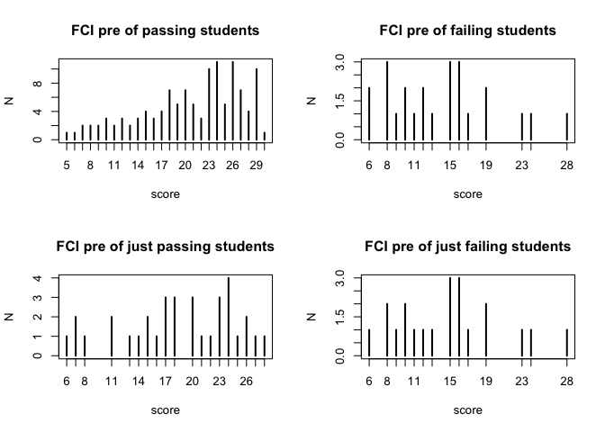<!-- --> \#\#\# FCI
impute 0 if NA

``` r
par(mfrow=c(2,2))
plot(table(V(accPS[[1]])$fci_pre_0[V(accPS[[1]])$pass==1]),ylab="N",xlab="score",main="FCI pre of passing students")
plot(table(V(accPS[[1]])$fci_pre_0[V(accPS[[1]])$pass==0]),ylab="N",xlab="score",main="FCI pre of failing students")
plot(table(V(accPS[[1]])$fci_pre_0[V(accPS[[1]])$justpass==1]),ylab="N",xlab="score",main="FCI pre of just passing students")
plot(table(V(accPS[[1]])$fci_pre_0[V(accPS[[1]])$justpass==0]),ylab="N",xlab="score",main="FCI pre of just failing students")
```

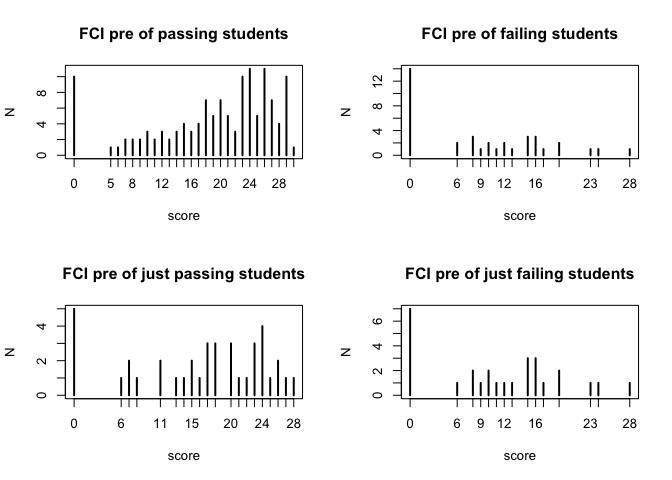<!-- --> \#\#\# FCI
impute random score selected from others with same grade if NA

``` r
par(mfrow=c(2,2))
plot(table(V(accPS[[1]])$fci_pre_s[V(accPS[[1]])$pass==1]),ylab="N",xlab="score",main="FCI pre of passing students")
plot(table(V(accPS[[1]])$fci_pre_s[V(accPS[[1]])$pass==0]),ylab="N",xlab="score",main="FCI pre of failing students")
plot(table(V(accPS[[1]])$fci_pre_s[V(accPS[[1]])$justpass==1]),ylab="N",xlab="score",main="FCI pre of just passing students")
plot(table(V(accPS[[1]])$fci_pre_s[V(accPS[[1]])$justpass==0]),ylab="N",xlab="score",main="FCI pre of just failing students")
```

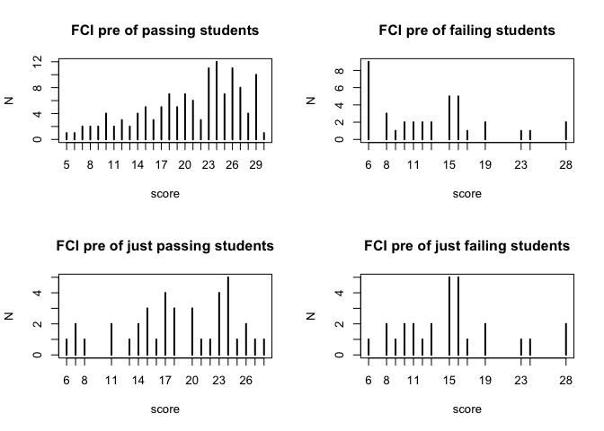<!-- -->

### FCI categories

``` r
par(mfrow=c(2,2))
plot(table(V(accPS[[1]])$fci_pre_c[V(accPS[[1]])$pass==1]),ylab="N",xlab="score",main="FCI pre of passing students")
plot(table(V(accPS[[1]])$fci_pre_c[V(accPS[[1]])$pass==0]),ylab="N",xlab="score",main="FCI pre of failing students")
plot(table(V(accPS[[1]])$fci_pre_c[V(accPS[[1]])$justpass==1]),ylab="N",xlab="score",main="FCI pre of just passing students")
plot(table(V(accPS[[1]])$fci_pre_c[V(accPS[[1]])$justpass==0]),ylab="N",xlab="score",main="FCI pre of just failing students")
```

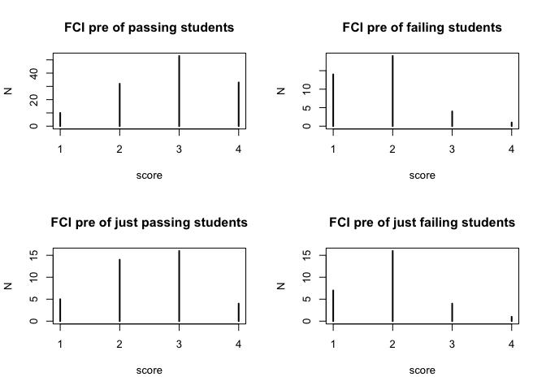<!-- -->

### Section number

``` r
par(mfrow=c(1,2))
c1<-table(V(accPS[[1]])$pass[V(accPS[[1]])$cohort==1])/length(which(V(accPS[[1]])$cohort==1))
c2<-table(V(accPS[[1]])$pass[V(accPS[[1]])$cohort==2])/length(which(V(accPS[[1]])$cohort==2))
c3<-table(V(accPS[[1]])$pass[V(accPS[[1]])$cohort==3])/length(which(V(accPS[[1]])$cohort==3))
c4<-table(V(accPS[[1]])$pass[V(accPS[[1]])$cohort==4])/length(which(V(accPS[[1]])$cohort==4))
c5<-table(V(accPS[[1]])$pass[V(accPS[[1]])$cohort==5])/length(which(V(accPS[[1]])$cohort==5))
c6<-table(V(accPS[[1]])$pass[V(accPS[[1]])$cohort==6])/length(which(V(accPS[[1]])$cohort==6))
c10<-table(V(accPS[[1]])$pass[V(accPS[[1]])$cohort==10])/length(which(V(accPS[[1]])$cohort==10))
cohfail<-c(c1[1],c2[1],c3[1],c4[1],c5[1],c6[1],c10[1])
cohpass<-c(c1[2],c2[2],c3[2],c4[2],c5[2],c6[2],c10[2])
plot(cohpass,xlab="Section number",ylab="Fraction",ylim=c(0,1),main="Passing and failing per section",col="darkgreen")
points(cohfail,col="red")
cj1<-table(V(accPS[[1]])$justpass[V(accPS[[1]])$cohort==1])/length(which(V(accPS[[1]])$cohort==1))
cj2<-table(V(accPS[[1]])$justpass[V(accPS[[1]])$cohort==2])/length(which(V(accPS[[1]])$cohort==2))
cj3<-table(V(accPS[[1]])$justpass[V(accPS[[1]])$cohort==3])/length(which(V(accPS[[1]])$cohort==3))
cj4<-table(V(accPS[[1]])$justpass[V(accPS[[1]])$cohort==4])/length(which(V(accPS[[1]])$cohort==4))
cj5<-table(V(accPS[[1]])$justpass[V(accPS[[1]])$cohort==5])/length(which(V(accPS[[1]])$cohort==5))
cj6<-table(V(accPS[[1]])$justpass[V(accPS[[1]])$cohort==6])/length(which(V(accPS[[1]])$cohort==6))
cj10<-table(V(accPS[[1]])$justpass[V(accPS[[1]])$cohort==10])/length(which(V(accPS[[1]])$cohort==10))
cohjfail<-c(cj1[1],cj2[1],cj3[1],cj4[1],cj5[1],cj6[1],cj10[1])
cohjpass<-c(cj1[2],cj2[2],cj3[2],cj4[2],cj5[2],cj6[2],cj10[2])
plot(cohjpass,xlab="Section number",ylab="Fraction of whole section",ylim=c(0,1),main="Just passing vs just failing",col="darkgreen")
points(cohjfail,col="red")
```

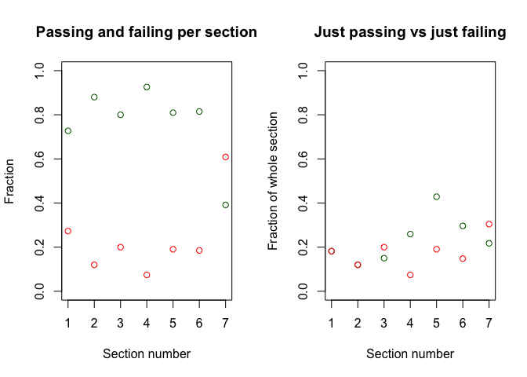<!-- --> \#\#
Problem solving layer \#\#\# Page rank difference

``` r
par(mfrow=c(2,2))
hist(accPS_PR[[7]]$vector[V(accPS[[7]])$pass==1],main="Pagerank of passing")
hist(accPS_PR[[7]]$vector[V(accPS[[7]])$pass==0],main="Pagerank of failing")
hist(accPS_PR[[7]]$vector[V(accPS[[7]])$justpass==1],main="Pagerank of just passing")
hist(accPS_PR[[7]]$vector[V(accPS[[7]])$justpass==0],main="Pagerank of just failing")
```

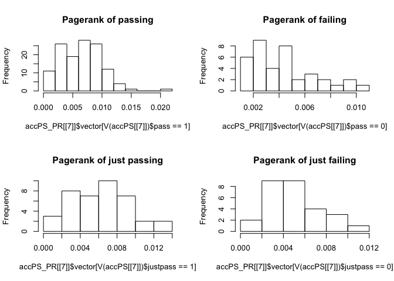<!-- -->

``` r
t.test(accPS_PR[[7]]$vector[V(accPS[[7]])$pass==1],accPS_PR[[7]]$vector[V(accPS[[7]])$pass==0])
```

    ## 
    ##  Welch Two Sample t-test
    ## 
    ## data:  accPS_PR[[7]]$vector[V(accPS[[7]])$pass == 1] and accPS_PR[[7]]$vector[V(accPS[[7]])$pass == 0]
    ## t = 4.2921, df = 82.187, p-value = 4.807e-05
    ## alternative hypothesis: true difference in means is not equal to 0
    ## 95 percent confidence interval:
    ##  0.001165521 0.003179134
    ## sample estimates:
    ##   mean of x   mean of y 
    ## 0.006521376 0.004349049

``` r
wilcox.test(accPS_PR[[7]]$vector[V(accPS[[7]])$pass==1],accPS_PR[[7]]$vector[V(accPS[[7]])$pass==0])
```

    ## 
    ##  Wilcoxon rank sum test with continuity correction
    ## 
    ## data:  accPS_PR[[7]]$vector[V(accPS[[7]])$pass == 1] and accPS_PR[[7]]$vector[V(accPS[[7]])$pass == 0]
    ## W = 3359, p-value = 0.0003693
    ## alternative hypothesis: true location shift is not equal to 0

``` r
t.test(accPS_PR[[7]]$vector[V(accPS[[7]])$justpass==1],accPS_PR[[7]]$vector[V(accPS[[7]])$justpass==0])
```

    ## 
    ##  Welch Two Sample t-test
    ## 
    ## data:  accPS_PR[[7]]$vector[V(accPS[[7]])$justpass == 1] and accPS_PR[[7]]$vector[V(accPS[[7]])$justpass == 0]
    ## t = 2.0144, df = 62.863, p-value = 0.04825
    ## alternative hypothesis: true difference in means is not equal to 0
    ## 95 percent confidence interval:
    ##  1.086488e-05 2.730883e-03
    ## sample estimates:
    ##   mean of x   mean of y 
    ## 0.006243573 0.004872699

``` r
wilcox.test(accPS_PR[[7]]$vector[V(accPS[[7]])$justpass==1],accPS_PR[[7]]$vector[V(accPS[[7]])$justpass==0])
```

    ## 
    ##  Wilcoxon rank sum test
    ## 
    ## data:  accPS_PR[[7]]$vector[V(accPS[[7]])$justpass == 1] and accPS_PR[[7]]$vector[V(accPS[[7]])$justpass == 0]
    ## W = 690, p-value = 0.0679
    ## alternative hypothesis: true location shift is not equal to 0

``` r
par(mfrow=c(2,2))
hist(accPS_TE[[7]][V(accPS[[7]])$pass==1],main="Target Entropy of passing")
hist(accPS_TE[[7]][V(accPS[[7]])$pass==0],main="Target Entropy of failing")
hist(accPS_TE[[7]][V(accPS[[7]])$justpass==1],main="Target Entropy of just passing")
hist(accPS_TE[[7]][V(accPS[[7]])$justpass==0],main="Target Entropy of just failing")
```

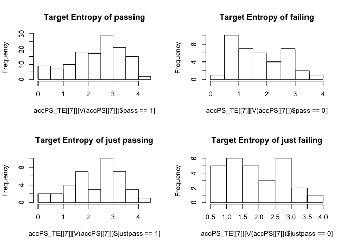<!-- -->

``` r
t.test(accPS_TE[[7]][V(accPS[[7]])$pass==1],accPS_TE[[7]][V(accPS[[7]])$pass==0])
```

    ## 
    ##  Welch Two Sample t-test
    ## 
    ## data:  accPS_TE[[7]][V(accPS[[7]])$pass == 1] and accPS_TE[[7]][V(accPS[[7]])$pass == 0]
    ## t = 3.6327, df = 69.377, p-value = 0.0005333
    ## alternative hypothesis: true difference in means is not equal to 0
    ## 95 percent confidence interval:
    ##  0.2800503 0.9621424
    ## sample estimates:
    ## mean of x mean of y 
    ##  2.344856  1.723759

``` r
wilcox.test(accPS_TE[[7]][V(accPS[[7]])$pass==1],accPS_TE[[7]][V(accPS[[7]])$pass==0])
```

    ## 
    ##  Wilcoxon rank sum test with continuity correction
    ## 
    ## data:  accPS_TE[[7]][V(accPS[[7]])$pass == 1] and accPS_TE[[7]][V(accPS[[7]])$pass == 0]
    ## W = 3378, p-value = 0.0002788
    ## alternative hypothesis: true location shift is not equal to 0

``` r
t.test(accPS_TE[[7]][V(accPS[[7]])$justpass==1],accPS_TE[[7]][V(accPS[[7]])$justpass==0])
```

    ## 
    ##  Welch Two Sample t-test
    ## 
    ## data:  accPS_TE[[7]][V(accPS[[7]])$justpass == 1] and accPS_TE[[7]][V(accPS[[7]])$justpass == 0]
    ## t = 1.8215, df = 62.265, p-value = 0.07333
    ## alternative hypothesis: true difference in means is not equal to 0
    ## 95 percent confidence interval:
    ##  -0.04025175  0.86753459
    ## sample estimates:
    ## mean of x mean of y 
    ##  2.327374  1.913732

``` r
wilcox.test(accPS_TE[[7]][V(accPS[[7]])$justpass==1],accPS_TE[[7]][V(accPS[[7]])$justpass==0])
```

    ## 
    ##  Wilcoxon rank sum test
    ## 
    ## data:  accPS_TE[[7]][V(accPS[[7]])$justpass == 1] and accPS_TE[[7]][V(accPS[[7]])$justpass == 0]
    ## W = 713, p-value = 0.03365
    ## alternative hypothesis: true location shift is not equal to 0

``` r
par(mfrow=c(2,2))
hist(accPS_H[[7]][V(accPS[[7]])$pass==1],main="Hide of passing")
hist(accPS_H[[7]][V(accPS[[7]])$pass==0],main="Hide of failing")
hist(accPS_H[[7]][V(accPS[[7]])$justpass==1],main="Hide of just passing")
hist(accPS_H[[7]][V(accPS[[7]])$justpass==0],main="Hide of just failing")
```

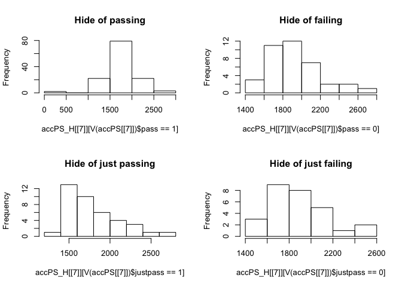<!-- -->

``` r
t.test(accPS_H[[7]][V(accPS[[7]])$pass==1],accPS_H[[7]][V(accPS[[7]])$pass==0])
```

    ## 
    ##  Welch Two Sample t-test
    ## 
    ## data:  accPS_H[[7]][V(accPS[[7]])$pass == 1] and accPS_H[[7]][V(accPS[[7]])$pass == 0]
    ## t = -3.3365, df = 87.884, p-value = 0.001245
    ## alternative hypothesis: true difference in means is not equal to 0
    ## 95 percent confidence interval:
    ##  -292.77130  -74.19516
    ## sample estimates:
    ## mean of x mean of y 
    ##  1748.350  1931.833

``` r
wilcox.test(accPS_H[[7]][V(accPS[[7]])$pass==1],accPS_H[[7]][V(accPS[[7]])$pass==0])
```

    ## 
    ##  Wilcoxon rank sum test with continuity correction
    ## 
    ## data:  accPS_H[[7]][V(accPS[[7]])$pass == 1] and accPS_H[[7]][V(accPS[[7]])$pass == 0]
    ## W = 1512, p-value = 0.0004091
    ## alternative hypothesis: true location shift is not equal to 0

``` r
t.test(accPS_H[[7]][V(accPS[[7]])$justpass==1],accPS_H[[7]][V(accPS[[7]])$justpass==0])
```

    ## 
    ##  Welch Two Sample t-test
    ## 
    ## data:  accPS_H[[7]][V(accPS[[7]])$justpass == 1] and accPS_H[[7]][V(accPS[[7]])$justpass == 0]
    ## t = -1.4266, df = 63.834, p-value = 0.1586
    ## alternative hypothesis: true difference in means is not equal to 0
    ## 95 percent confidence interval:
    ##  -239.48379   39.95149
    ## sample estimates:
    ## mean of x mean of y 
    ##  1798.392  1898.158

``` r
wilcox.test(accPS_H[[7]][V(accPS[[7]])$justpass==1],accPS_H[[7]][V(accPS[[7]])$justpass==0])
```

    ## 
    ##  Wilcoxon rank sum test
    ## 
    ## data:  accPS_H[[7]][V(accPS[[7]])$justpass == 1] and accPS_H[[7]][V(accPS[[7]])$justpass == 0]
    ## W = 403, p-value = 0.06987
    ## alternative hypothesis: true location shift is not equal to 0

## Concept Discussion layer

### Page rank difference

``` r
par(mfrow=c(2,2))
hist(accCD_PR[[7]]$vector[V(accCD[[7]])$pass==1],main="Pagerank of passing")
hist(accCD_PR[[7]]$vector[V(accCD[[7]])$pass==0],main="Pagerank of failing")
hist(accCD_PR[[7]]$vector[V(accCD[[7]])$justpass==1],main="Pagerank of just passing")
hist(accCD_PR[[7]]$vector[V(accCD[[7]])$justpass==0],main="Pagerank of just failing")
```

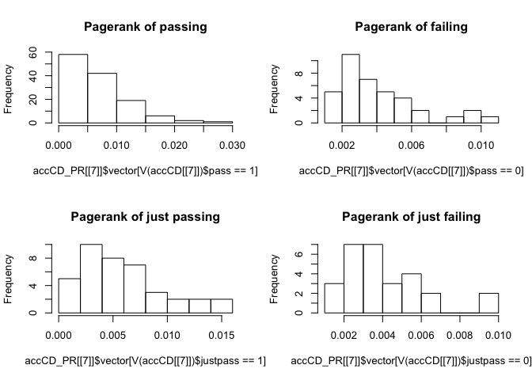<!-- -->

``` r
t.test(accCD_PR[[7]]$vector[V(accCD[[7]])$pass==1],accCD_PR[[7]]$vector[V(accCD[[7]])$pass==0])
```

    ## 
    ##  Welch Two Sample t-test
    ## 
    ## data:  accCD_PR[[7]]$vector[V(accCD[[7]])$pass == 1] and accCD_PR[[7]]$vector[V(accCD[[7]])$pass == 0]
    ## t = 4.3191, df = 124.76, p-value = 3.164e-05
    ## alternative hypothesis: true difference in means is not equal to 0
    ## 95 percent confidence interval:
    ##  0.001339729 0.003606025
    ## sample estimates:
    ##   mean of x   mean of y 
    ## 0.006590177 0.004117300

``` r
wilcox.test(accCD_PR[[7]]$vector[V(accCD[[7]])$pass==1],accCD_PR[[7]]$vector[V(accCD[[7]])$pass==0])
```

    ## 
    ##  Wilcoxon rank sum test with continuity correction
    ## 
    ## data:  accCD_PR[[7]]$vector[V(accCD[[7]])$pass == 1] and accCD_PR[[7]]$vector[V(accCD[[7]])$pass == 0]
    ## W = 3247, p-value = 0.00174
    ## alternative hypothesis: true location shift is not equal to 0

``` r
t.test(accCD_PR[[7]]$vector[V(accCD[[7]])$justpass==1],accCD_PR[[7]]$vector[V(accCD[[7]])$justpass==0])
```

    ## 
    ##  Welch Two Sample t-test
    ## 
    ## data:  accCD_PR[[7]]$vector[V(accCD[[7]])$justpass == 1] and accCD_PR[[7]]$vector[V(accCD[[7]])$justpass == 0]
    ## t = 2.5086, df = 62.886, p-value = 0.01471
    ## alternative hypothesis: true difference in means is not equal to 0
    ## 95 percent confidence interval:
    ##  0.0003636771 0.0032125096
    ## sample estimates:
    ##   mean of x   mean of y 
    ## 0.005891567 0.004103474

``` r
wilcox.test(accCD_PR[[7]]$vector[V(accCD[[7]])$justpass==1],accCD_PR[[7]]$vector[V(accCD[[7]])$justpass==0])
```

    ## Warning in wilcox.test.default(accCD_PR[[7]]$vector[V(accCD[[7]])$justpass == :
    ## cannot compute exact p-value with ties

    ## 
    ##  Wilcoxon rank sum test with continuity correction
    ## 
    ## data:  accCD_PR[[7]]$vector[V(accCD[[7]])$justpass == 1] and accCD_PR[[7]]$vector[V(accCD[[7]])$justpass == 0]
    ## W = 711, p-value = 0.03645
    ## alternative hypothesis: true location shift is not equal to 0

``` r
par(mfrow=c(2,2))
hist(accCD_TE[[7]][V(accCD[[7]])$pass==1],main="Target Entropy of passing")
hist(accCD_TE[[7]][V(accCD[[7]])$pass==0],main="Target Entropy of failing")
hist(accCD_TE[[7]][V(accCD[[7]])$justpass==1],main="Target Entropy of just passing")
hist(accCD_TE[[7]][V(accCD[[7]])$justpass==0],main="Target Entropy of just failing")
```

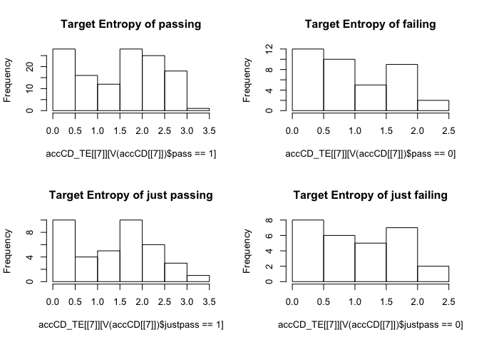<!-- -->

``` r
t.test(accCD_TE[[7]][V(accCD[[7]])$pass==1],accCD_TE[[7]][V(accCD[[7]])$pass==0])
```

    ## 
    ##  Welch Two Sample t-test
    ## 
    ## data:  accCD_TE[[7]][V(accCD[[7]])$pass == 1] and accCD_TE[[7]][V(accCD[[7]])$pass == 0]
    ## t = 3.6897, df = 79.541, p-value = 0.0004093
    ## alternative hypothesis: true difference in means is not equal to 0
    ## 95 percent confidence interval:
    ##  0.2419638 0.8086826
    ## sample estimates:
    ## mean of x mean of y 
    ## 1.4699234 0.9446003

``` r
wilcox.test(accCD_TE[[7]][V(accCD[[7]])$pass==1],accCD_TE[[7]][V(accCD[[7]])$pass==0])
```

    ## 
    ##  Wilcoxon rank sum test with continuity correction
    ## 
    ## data:  accCD_TE[[7]][V(accCD[[7]])$pass == 1] and accCD_TE[[7]][V(accCD[[7]])$pass == 0]
    ## W = 3268, p-value = 0.00129
    ## alternative hypothesis: true location shift is not equal to 0

``` r
t.test(accCD_TE[[7]][V(accCD[[7]])$justpass==1],accCD_TE[[7]][V(accCD[[7]])$justpass==0])
```

    ## 
    ##  Welch Two Sample t-test
    ## 
    ## data:  accCD_TE[[7]][V(accCD[[7]])$justpass == 1] and accCD_TE[[7]][V(accCD[[7]])$justpass == 0]
    ## t = 1.7455, df = 64.773, p-value = 0.08564
    ## alternative hypothesis: true difference in means is not equal to 0
    ## 95 percent confidence interval:
    ##  -0.04985913  0.74114727
    ## sample estimates:
    ## mean of x mean of y 
    ##  1.362747  1.017103

``` r
wilcox.test(accCD_TE[[7]][V(accCD[[7]])$justpass==1],accCD_TE[[7]][V(accCD[[7]])$justpass==0])
```

    ## Warning in wilcox.test.default(accCD_TE[[7]][V(accCD[[7]])$justpass == 1], :
    ## cannot compute exact p-value with ties

    ## 
    ##  Wilcoxon rank sum test with continuity correction
    ## 
    ## data:  accCD_TE[[7]][V(accCD[[7]])$justpass == 1] and accCD_TE[[7]][V(accCD[[7]])$justpass == 0]
    ## W = 675.5, p-value = 0.1006
    ## alternative hypothesis: true location shift is not equal to 0

``` r
par(mfrow=c(2,2))
hist(accCD_H[[7]][V(accCD[[7]])$pass==1],main="Hide of passing")
hist(accCD_H[[7]][V(accCD[[7]])$pass==0],main="Hide of failing")
hist(accCD_H[[7]][V(accCD[[7]])$justpass==1],main="Hide of just passing")
hist(accCD_H[[7]][V(accCD[[7]])$justpass==0],main="Hide of just failing")
```

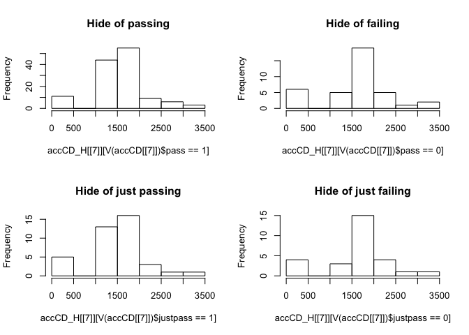<!-- -->

``` r
t.test(accCD_H[[7]][V(accCD[[7]])$pass==1],accCD_H[[7]][V(accCD[[7]])$pass==0])
```

    ## 
    ##  Welch Two Sample t-test
    ## 
    ## data:  accCD_H[[7]][V(accCD[[7]])$pass == 1] and accCD_H[[7]][V(accCD[[7]])$pass == 0]
    ## t = -0.31999, df = 50.891, p-value = 0.7503
    ## alternative hypothesis: true difference in means is not equal to 0
    ## 95 percent confidence interval:
    ##  -330.6557  239.7433
    ## sample estimates:
    ## mean of x mean of y 
    ##  1544.629  1590.085

``` r
wilcox.test(accCD_H[[7]][V(accCD[[7]])$pass==1],accCD_H[[7]][V(accCD[[7]])$pass==0])
```

    ## 
    ##  Wilcoxon rank sum test with continuity correction
    ## 
    ## data:  accCD_H[[7]][V(accCD[[7]])$pass == 1] and accCD_H[[7]][V(accCD[[7]])$pass == 0]
    ## W = 1960, p-value = 0.06988
    ## alternative hypothesis: true location shift is not equal to 0

``` r
t.test(accCD_H[[7]][V(accCD[[7]])$justpass==1],accCD_H[[7]][V(accCD[[7]])$justpass==0])
```

    ## 
    ##  Welch Two Sample t-test
    ## 
    ## data:  accCD_H[[7]][V(accCD[[7]])$justpass == 1] and accCD_H[[7]][V(accCD[[7]])$justpass == 0]
    ## t = -1.0346, df = 53.214, p-value = 0.3055
    ## alternative hypothesis: true difference in means is not equal to 0
    ## 95 percent confidence interval:
    ##  -543.4374  173.5570
    ## sample estimates:
    ## mean of x mean of y 
    ##  1448.344  1633.284

``` r
wilcox.test(accCD_H[[7]][V(accCD[[7]])$justpass==1],accCD_H[[7]][V(accCD[[7]])$justpass==0])
```

    ## Warning in wilcox.test.default(accCD_H[[7]][V(accCD[[7]])$justpass == 1], :
    ## cannot compute exact p-value with ties

    ## 
    ##  Wilcoxon rank sum test with continuity correction
    ## 
    ## data:  accCD_H[[7]][V(accCD[[7]])$justpass == 1] and accCD_H[[7]][V(accCD[[7]])$justpass == 0]
    ## W = 350, p-value = 0.01291
    ## alternative hypothesis: true location shift is not equal to 0

## In Class Social layer

### Page rank difference

``` r
par(mfrow=c(2,2))
hist(accICS_PR[[7]]$vector[V(accICS[[7]])$pass==1],main="Pagerank of passing")
hist(accICS_PR[[7]]$vector[V(accICS[[7]])$pass==0],main="Pagerank of failing")
hist(accICS_PR[[7]]$vector[V(accICS[[7]])$justpass==1],main="Pagerank of just passing")
hist(accICS_PR[[7]]$vector[V(accICS[[7]])$justpass==0],main="Pagerank of just failing")
```

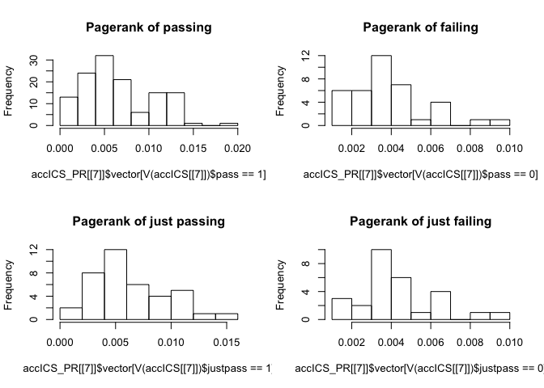<!-- -->

``` r
t.test(accICS_PR[[7]]$vector[V(accICS[[7]])$pass==1],accICS_PR[[7]]$vector[V(accICS[[7]])$pass==0])
```

    ## 
    ##  Welch Two Sample t-test
    ## 
    ## data:  accICS_PR[[7]]$vector[V(accICS[[7]])$pass == 1] and accICS_PR[[7]]$vector[V(accICS[[7]])$pass == 0]
    ## t = 5.8955, df = 126.33, p-value = 3.195e-08
    ## alternative hypothesis: true difference in means is not equal to 0
    ## 95 percent confidence interval:
    ##  0.001804640 0.003628276
    ## sample estimates:
    ##   mean of x   mean of y 
    ## 0.006645936 0.003929478

``` r
wilcox.test(accICS_PR[[7]]$vector[V(accICS[[7]])$pass==1],accICS_PR[[7]]$vector[V(accICS[[7]])$pass==0])
```

    ## 
    ##  Wilcoxon rank sum test with continuity correction
    ## 
    ## data:  accICS_PR[[7]]$vector[V(accICS[[7]])$pass == 1] and accICS_PR[[7]]$vector[V(accICS[[7]])$pass == 0]
    ## W = 3508, p-value = 3.566e-05
    ## alternative hypothesis: true location shift is not equal to 0

``` r
t.test(accICS_PR[[7]]$vector[V(accICS[[7]])$justpass==1],accICS_PR[[7]]$vector[V(accICS[[7]])$justpass==0])
```

    ## 
    ##  Welch Two Sample t-test
    ## 
    ## data:  accICS_PR[[7]]$vector[V(accICS[[7]])$justpass == 1] and accICS_PR[[7]]$vector[V(accICS[[7]])$justpass == 0]
    ## t = 3.1029, df = 63.577, p-value = 0.002859
    ## alternative hypothesis: true difference in means is not equal to 0
    ## 95 percent confidence interval:
    ##  0.0007085704 0.0032712550
    ## sample estimates:
    ##   mean of x   mean of y 
    ## 0.006376039 0.004386126

``` r
wilcox.test(accICS_PR[[7]]$vector[V(accICS[[7]])$justpass==1],accICS_PR[[7]]$vector[V(accICS[[7]])$justpass==0])
```

    ## Warning in wilcox.test.default(accICS_PR[[7]]$vector[V(accICS[[7]])$justpass
    ## == : cannot compute exact p-value with ties

    ## 
    ##  Wilcoxon rank sum test with continuity correction
    ## 
    ## data:  accICS_PR[[7]]$vector[V(accICS[[7]])$justpass == 1] and accICS_PR[[7]]$vector[V(accICS[[7]])$justpass == 0]
    ## W = 759, p-value = 0.006903
    ## alternative hypothesis: true location shift is not equal to 0

``` r
par(mfrow=c(2,2))
hist(accICS_TE[[7]][V(accICS[[7]])$pass==1],main="Target Entropy of passing")
hist(accICS_TE[[7]][V(accICS[[7]])$pass==0],main="Target Entropy of failing")
hist(accICS_TE[[7]][V(accICS[[7]])$justpass==1],main="Target Entropy of just passing")
hist(accICS_TE[[7]][V(accICS[[7]])$justpass==0],main="Target Entropy of just failing")
```

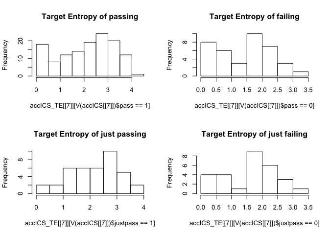<!-- -->

``` r
t.test(accICS_TE[[7]][V(accICS[[7]])$pass==1],accICS_TE[[7]][V(accICS[[7]])$pass==0])
```

    ## 
    ##  Welch Two Sample t-test
    ## 
    ## data:  accICS_TE[[7]][V(accICS[[7]])$pass == 1] and accICS_TE[[7]][V(accICS[[7]])$pass == 0]
    ## t = 3.9962, df = 74.091, p-value = 0.0001505
    ## alternative hypothesis: true difference in means is not equal to 0
    ## 95 percent confidence interval:
    ##  0.3677683 1.0991996
    ## sample estimates:
    ## mean of x mean of y 
    ##  2.105811  1.372328

``` r
wilcox.test(accICS_TE[[7]][V(accICS[[7]])$pass==1],accICS_TE[[7]][V(accICS[[7]])$pass==0])
```

    ## 
    ##  Wilcoxon rank sum test with continuity correction
    ## 
    ## data:  accICS_TE[[7]][V(accICS[[7]])$pass == 1] and accICS_TE[[7]][V(accICS[[7]])$pass == 0]
    ## W = 3398, p-value = 0.0002019
    ## alternative hypothesis: true location shift is not equal to 0

``` r
t.test(accICS_TE[[7]][V(accICS[[7]])$justpass==1],accICS_TE[[7]][V(accICS[[7]])$justpass==0])
```

    ## 
    ##  Welch Two Sample t-test
    ## 
    ## data:  accICS_TE[[7]][V(accICS[[7]])$justpass == 1] and accICS_TE[[7]][V(accICS[[7]])$justpass == 0]
    ## t = 2.5943, df = 58.27, p-value = 0.01197
    ## alternative hypothesis: true difference in means is not equal to 0
    ## 95 percent confidence interval:
    ##  0.1327624 1.0292943
    ## sample estimates:
    ## mean of x mean of y 
    ##  2.146499  1.565471

``` r
wilcox.test(accICS_TE[[7]][V(accICS[[7]])$justpass==1],accICS_TE[[7]][V(accICS[[7]])$justpass==0])
```

    ## Warning in wilcox.test.default(accICS_TE[[7]][V(accICS[[7]])$justpass == :
    ## cannot compute exact p-value with ties

    ## 
    ##  Wilcoxon rank sum test with continuity correction
    ## 
    ## data:  accICS_TE[[7]][V(accICS[[7]])$justpass == 1] and accICS_TE[[7]][V(accICS[[7]])$justpass == 0]
    ## W = 735, p-value = 0.01652
    ## alternative hypothesis: true location shift is not equal to 0

``` r
par(mfrow=c(2,2))
hist(accICS_H[[7]][V(accICS[[7]])$pass==1],main="Hide of passing")
hist(accICS_H[[7]][V(accICS[[7]])$pass==0],main="Hide of failing")
hist(accICS_H[[7]][V(accICS[[7]])$justpass==1],main="Hide of just passing")
hist(accICS_H[[7]][V(accICS[[7]])$justpass==0],main="Hide of just failing")
```

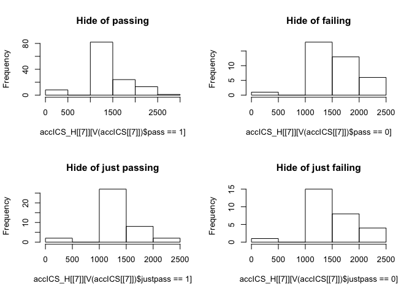<!-- -->

``` r
t.test(accICS_H[[7]][V(accICS[[7]])$pass==1],accICS_H[[7]][V(accICS[[7]])$pass==0])
```

    ## 
    ##  Welch Two Sample t-test
    ## 
    ## data:  accICS_H[[7]][V(accICS[[7]])$pass == 1] and accICS_H[[7]][V(accICS[[7]])$pass == 0]
    ## t = -2.7948, df = 74.151, p-value = 0.006607
    ## alternative hypothesis: true difference in means is not equal to 0
    ## 95 percent confidence interval:
    ##  -376.2145  -63.0535
    ## sample estimates:
    ## mean of x mean of y 
    ##  1378.832  1598.466

``` r
wilcox.test(accICS_H[[7]][V(accICS[[7]])$pass==1],accICS_H[[7]][V(accICS[[7]])$pass==0])
```

    ## 
    ##  Wilcoxon rank sum test with continuity correction
    ## 
    ## data:  accICS_H[[7]][V(accICS[[7]])$pass == 1] and accICS_H[[7]][V(accICS[[7]])$pass == 0]
    ## W = 1487, p-value = 0.000283
    ## alternative hypothesis: true location shift is not equal to 0

``` r
t.test(accICS_H[[7]][V(accICS[[7]])$justpass==1],accICS_H[[7]][V(accICS[[7]])$justpass==0])
```

    ## 
    ##  Welch Two Sample t-test
    ## 
    ## data:  accICS_H[[7]][V(accICS[[7]])$justpass == 1] and accICS_H[[7]][V(accICS[[7]])$justpass == 0]
    ## t = -1.7922, df = 56.457, p-value = 0.07846
    ## alternative hypothesis: true difference in means is not equal to 0
    ## 95 percent confidence interval:
    ##  -400.04102   22.21097
    ## sample estimates:
    ## mean of x mean of y 
    ##  1361.292  1550.207

``` r
wilcox.test(accICS_H[[7]][V(accICS[[7]])$justpass==1],accICS_H[[7]][V(accICS[[7]])$justpass==0])
```

    ## Warning in wilcox.test.default(accICS_H[[7]][V(accICS[[7]])$justpass == : cannot
    ## compute exact p-value with ties

    ## 
    ##  Wilcoxon rank sum test with continuity correction
    ## 
    ## data:  accICS_H[[7]][V(accICS[[7]])$justpass == 1] and accICS_H[[7]][V(accICS[[7]])$justpass == 0]
    ## W = 367, p-value = 0.02325
    ## alternative hypothesis: true location shift is not equal to 0
