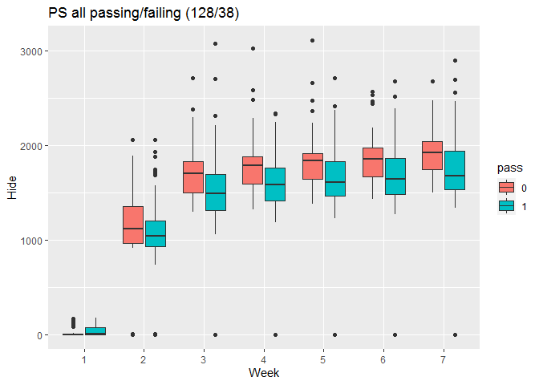
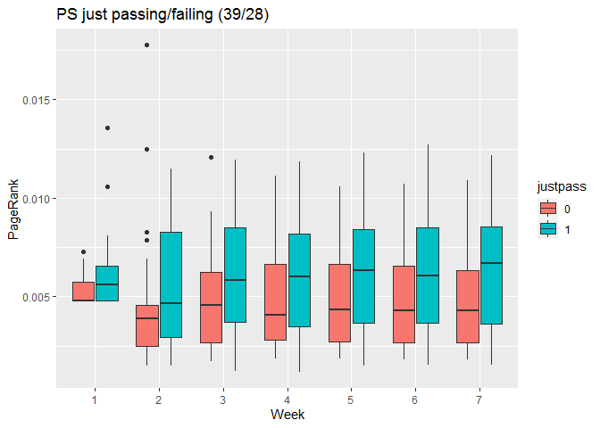
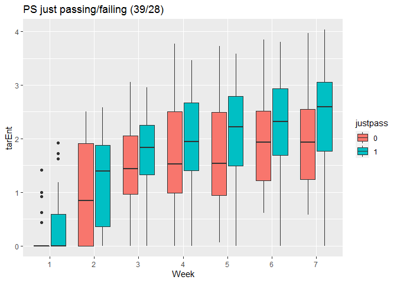
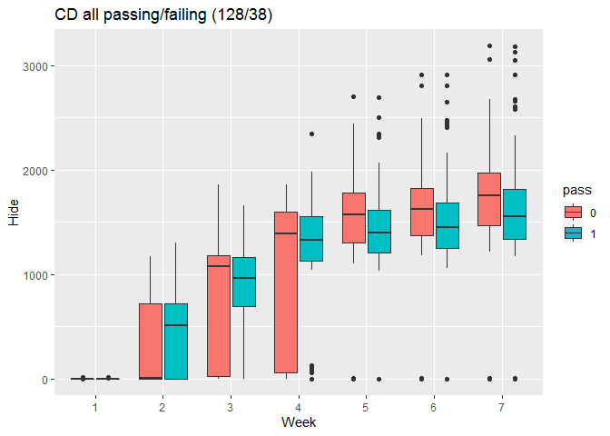
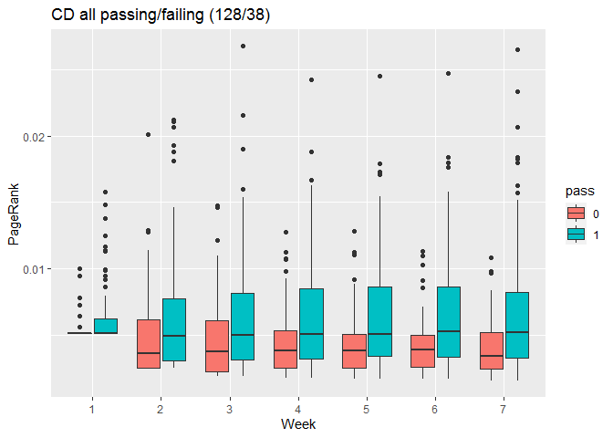
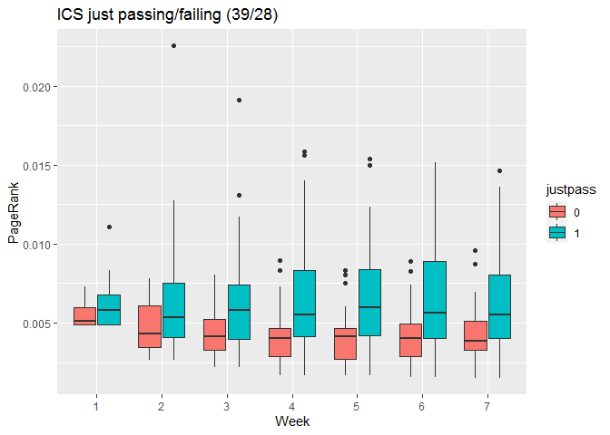
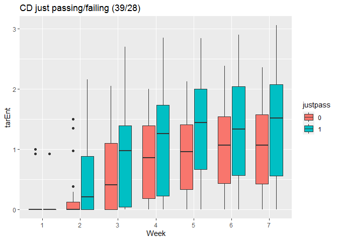
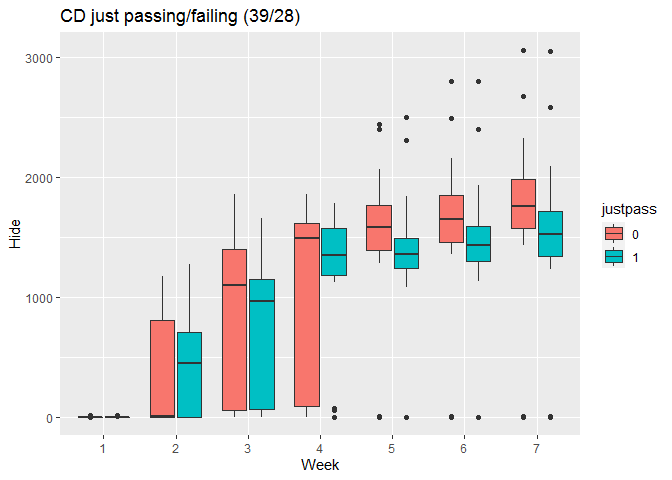

Goal for this document is to make exploratory plots and run logistic regression for passing and failing in the (single-layer) PS, CD, and ICS weekly networks.

**Update 5/8:** Wrapping up centrality boxplots in its own file, and removing that from `logistic_regression.Rmd`. 


```
## 
## Attaching package: 'igraph'
```

```
## The following objects are masked from 'package:stats':
## 
##     decompose, spectrum
```

```
## The following object is masked from 'package:base':
## 
##     union
```

```
## 
## Attaching package: 'dplyr'
```

```
## The following objects are masked from 'package:igraph':
## 
##     as_data_frame, groups, union
```

```
## The following objects are masked from 'package:stats':
## 
##     filter, lag
```

```
## The following objects are masked from 'package:base':
## 
##     intersect, setdiff, setequal, union
```

## Import data

At this point, `loadAllNetworks` and `calculatePR_TE_H` have already been run. **Update 5/8/20:** So has `make_node_data_frames.Rmd`. Importing the results of that gives me three long data frames. Each has all the node info (including centrality values), by week, for a single layer. 


```r
(load("../data/centrality_data_frames.Rdata"))
```

```
## [1] "dfPS"      "dfCD"      "dfICS"     "nPass"     "nJustPass"
```

Check the contents:

```r
head(dfPS)
```

```
##   Week    name grade gender age cohort sog fci_pre fci_pre_0 fci_pre_s
## 1    1 Person1     2      1  19      3   6      17        17        17
## 2    1 Person2    -3      1  20     10  NA      NA         0         6
## 3    1 Person3     0      1  22     10   9      NA         0        15
## 4    1 Person4     4      1  19      6  20      28        28        28
## 5    1 Person5     2      1  27      1   7      26        26        26
## 6    1 Person6     4      1  20      2   0      18        18        18
##   fci_pre_c pass justpass Week.1    PageRank    tarEnt       Hide
## 1         2    1        1      1 0.004780164 0.0000000   0.000000
## 2         1    0     <NA>      1 0.005915686 0.4138169 114.230046
## 3         1    0        0      1 0.004780164 0.0000000   0.000000
## 4         4    1     <NA>      1 0.005997961 0.0000000  13.228819
## 5         4    1        1      1 0.004780164 0.0000000   0.000000
## 6         3    1     <NA>      1 0.009249618 1.0000000   3.321928
```

```r
head(dfCD)
```

```
##   Week    name grade gender age cohort sog fci_pre fci_pre_0 fci_pre_s
## 1    1 Person1     2      1  19      3   6      17        17        17
## 2    1 Person2    -3      1  20     10  NA      NA         0         6
## 3    1 Person3     0      1  22     10   9      NA         0        15
## 4    1 Person4     4      1  19      6  20      28        28        28
## 5    1 Person5     2      1  27      1   7      26        26        26
## 6    1 Person6     4      1  20      2   0      18        18        18
##   fci_pre_c pass justpass Week.1    PageRank tarEnt Hide
## 1         2    1        1      1 0.005117532      0    0
## 2         1    0     <NA>      1 0.007292484      0    1
## 3         1    0        0      1 0.005117532      0    0
## 4         4    1     <NA>      1 0.005117532      0    0
## 5         4    1        1      1 0.005117532      0    0
## 6         3    1     <NA>      1 0.009467435      0    0
```

```r
head(dfICS)
```

```
##   Week    name grade gender age cohort sog fci_pre fci_pre_0 fci_pre_s
## 1    1 Person1     2      1  19      3   6      17        17        17
## 2    1 Person2    -3      1  20     10  NA      NA         0         6
## 3    1 Person3     0      1  22     10   9      NA         0        15
## 4    1 Person4     4      1  19      6  20      28        28        28
## 5    1 Person5     2      1  27      1   7      26        26        26
## 6    1 Person6     4      1  20      2   0      18        18        18
##   fci_pre_c pass justpass Week.1    PageRank   tarEnt       Hide
## 1         2    1        1      1 0.004912848 0.000000   0.000000
## 2         1    0     <NA>      1 0.005191243 0.000000   3.906891
## 3         1    0        0      1 0.004912848 0.000000   0.000000
## 4         4    1     <NA>      1 0.006882272 1.500000  13.943064
## 5         4    1        1      1 0.004912848 0.000000   0.000000
## 6         3    1     <NA>      1 0.012240235 1.378419 144.061667
```


## Pass/fail boxplots

Now I can do the boxplots I need. For PageRank...


```r
ggplot(dfPS, aes(x = Week, y = PageRank)) + 
  geom_boxplot(aes(fill = pass)) + #theme(aspect.ratio = 4/7) +
  ggtitle(paste0("PS all passing/failing (",nPass[2],"/",nPass[1],")"))
```

<!-- -->

```r
dfPS %>% filter(is.na(justpass) == FALSE) %>% 
  ggplot(aes(x = Week, y = PageRank)) + 
  geom_boxplot(aes(fill = justpass)) + #theme(aspect.ratio = 4/7) +
  ggtitle(paste0("PS just passing/failing (",nJustPass[2],"/",nJustPass[1],")"))
```

<!-- -->

The plot for all passing/failing looks pretty much the same as my old one. The justpass/justfail plot also looks similar, but seems to be missing some outlier points relative to the old plot. That's weird, since it has a few more data points in it. 

For Target Entropy:

```r
ggplot(dfPS, aes(x = Week, y = tarEnt)) + 
  geom_boxplot(aes(fill = pass)) + 
  ggtitle(paste0("PS all passing/failing (",nPass[2],"/",nPass[1],")"))
```

<!-- -->

```r
dfPS %>% filter(is.na(justpass) == FALSE) %>% 
  ggplot(aes(x = Week, y = tarEnt)) + 
  geom_boxplot(aes(fill = justpass)) + 
  ggtitle(paste0("PS just passing/failing (",nJustPass[2],"/",nJustPass[1],")"))
```

<!-- -->

and for Hide:

```r
ggplot(dfPS, aes(x = Week, y = Hide)) + 
  geom_boxplot(aes(fill = pass)) + 
  ggtitle(paste0("PS all passing/failing (",nPass[2],"/",nPass[1],")"))
```

<!-- -->

```r
dfPS %>% filter(is.na(justpass) == FALSE) %>% 
  ggplot(aes(x = Week, y = Hide)) + 
  geom_boxplot(aes(fill = justpass)) + 
  ggtitle(paste0("PS just passing/failing (",nJustPass[2],"/",nJustPass[1],")"))
```

<!-- -->

### Concept discussion layer

First PageRank:


```r
ggplot(dfCD, aes(x = Week, y = PageRank)) + 
  geom_boxplot(aes(fill = pass)) + 
  ggtitle(paste0("CD all passing/failing (",nPass[2],"/",nPass[1],")"))
```

<!-- -->

```r
dfCD %>% filter(is.na(justpass) == FALSE) %>% 
  ggplot(aes(x = Week, y = PageRank)) + 
  geom_boxplot(aes(fill = justpass)) + 
  ggtitle(paste0("CD just passing/failing (",nJustPass[2],"/",nJustPass[1],")"))
```

<!-- -->

For Target Entropy:

```r
ggplot(dfCD, aes(x = Week, y = tarEnt)) + 
  geom_boxplot(aes(fill = pass)) + 
  ggtitle(paste0("CD all passing/failing (",nPass[2],"/",nPass[1],")"))
```

<!-- -->

```r
dfCD %>% filter(is.na(justpass) == FALSE) %>% 
  ggplot(aes(x = Week, y = tarEnt)) + 
  geom_boxplot(aes(fill = justpass)) + 
  ggtitle(paste0("CD just passing/failing (",nJustPass[2],"/",nJustPass[1],")"))
```

<!-- -->

and for Hide:

```r
ggplot(dfCD, aes(x = Week, y = Hide)) + 
  geom_boxplot(aes(fill = pass)) + 
  ggtitle(paste0("CD all passing/failing (",nPass[2],"/",nPass[1],")"))
```

<!-- -->

```r
dfCD %>% filter(is.na(justpass) == FALSE) %>% 
  ggplot(aes(x = Week, y = Hide)) + 
  geom_boxplot(aes(fill = justpass)) + 
  ggtitle(paste0("CD just passing/failing (",nJustPass[2],"/",nJustPass[1],")"))
```

<!-- -->


### In-class socializing layer

And the third set of boxplots. First PageRank:


```r
ggplot(dfICS, aes(x = Week, y = PageRank)) + 
  geom_boxplot(aes(fill = pass)) + 
  ggtitle(paste0("ICS all passing/failing (",nPass[2],"/",nPass[1],")"))
```

<!-- -->

```r
dfICS %>% filter(is.na(justpass) == FALSE) %>% 
  ggplot(aes(x = Week, y = PageRank)) + 
  geom_boxplot(aes(fill = justpass)) + 
  ggtitle(paste0("ICS just passing/failing (",nJustPass[2],"/",nJustPass[1],")"))
```

<!-- -->

For Target Entropy:

```r
ggplot(dfICS, aes(x = Week, y = tarEnt)) + 
  geom_boxplot(aes(fill = pass)) + 
  ggtitle(paste0("ICS all passing/failing (",nPass[2],"/",nPass[1],")"))
```

<!-- -->

```r
dfICS %>% filter(is.na(justpass) == FALSE) %>% 
  ggplot(aes(x = Week, y = tarEnt)) + 
  geom_boxplot(aes(fill = justpass)) + 
  ggtitle(paste0("ICS just passing/failing (",nJustPass[2],"/",nJustPass[1],")"))
```

<!-- -->

and for Hide:

```r
ggplot(dfICS, aes(x = Week, y = Hide)) + 
  geom_boxplot(aes(fill = pass)) + 
  ggtitle(paste0("ICS all passing/failing (",nPass[2],"/",nPass[1],")"))
```

<!-- -->

```r
dfICS %>% filter(is.na(justpass) == FALSE) %>% 
  ggplot(aes(x = Week, y = Hide)) + 
  geom_boxplot(aes(fill = justpass)) + 
  ggtitle(paste0("ICS just passing/failing (",nJustPass[2],"/",nJustPass[1],")"))
```

<!-- -->

