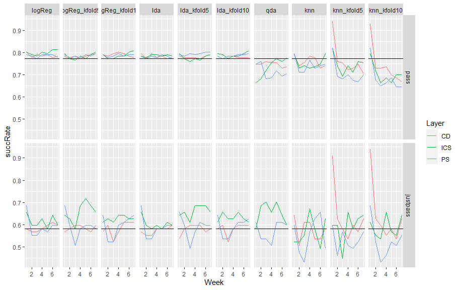

Goal for this document is to summarize results from the cross-validation methods we used: Leave One Out Cross-Validation aka LOOCV aka jackknife, and k-fold cross-validation with `k=5` and `k=10`.

**Update 25 Mar:** Updated success rates (LOOCV files were using an outdated set of predictors) and remade the facet grid plot. 


```
## Warning: package 'igraph' was built under R version 4.0.3
```

```
## Warning: package 'tibble' was built under R version 4.0.3
```

## Import data

At this point, the following R scripts have already been run. 

* For LOOCV: `passfail_logreg_jackknife`, `passfail_lda_jackknife`, `passfail_qda_jackknife`, and `passfail_knn_jackknife`. 
* For k-fold cross-validation: `passfail_logreg_kfold`, `passfail_lda_lfold`, `passfail_qda_kfold` (ultimately not used, see notes below), and `passfail_knn_kfold`. 

Each of those files saves the predictions in an .Rdata file in the `data` directory and the success rate table in the `results` directory. Results are saved separately for the full set of pass/fail outcomes and for students who were just on the pass/fail border (the justpass outcome, saved in `Just` files). The k-fold results were saved for `k=5` and `k=10`. 


```r
filelist <- list.files(path = "../results", pattern = "*.csv")
infiles <- file.path("../results", filelist)
infiles 
```

```
##  [1] "../results/succRate_knn.csv"               
##  [2] "../results/succRate_knn_kfold10.csv"       
##  [3] "../results/succRate_knn_kfold5.csv"        
##  [4] "../results/succRate_knn_noFCI.csv"         
##  [5] "../results/succRate_lda.csv"               
##  [6] "../results/succRate_lda_kfold10.csv"       
##  [7] "../results/succRate_lda_kfold5.csv"        
##  [8] "../results/succRate_logReg.csv"            
##  [9] "../results/succRate_logReg_kfold10.csv"    
## [10] "../results/succRate_logReg_kfold5.csv"     
## [11] "../results/succRate_qda.csv"               
## [12] "../results/succRateJust_knn.csv"           
## [13] "../results/succRateJust_knn_kfold10.csv"   
## [14] "../results/succRateJust_knn_kfold5.csv"    
## [15] "../results/succRateJust_knn_noFCI.csv"     
## [16] "../results/succRateJust_lda.csv"           
## [17] "../results/succRateJust_lda_kfold10.csv"   
## [18] "../results/succRateJust_lda_kfold5.csv"    
## [19] "../results/succRateJust_logReg.csv"        
## [20] "../results/succRateJust_logReg_kfold10.csv"
## [21] "../results/succRateJust_logReg_kfold5.csv" 
## [22] "../results/succRateJust_qda.csv"
```

```r
allSuccRates <- lapply(infiles, read.csv) 
summary(allSuccRates)
```

```
##       Length Class      Mode
##  [1,] 11     data.frame list
##  [2,] 11     data.frame list
##  [3,] 11     data.frame list
##  [4,] 11     data.frame list
##  [5,] 10     data.frame list
##  [6,] 10     data.frame list
##  [7,] 10     data.frame list
##  [8,] 10     data.frame list
##  [9,] 10     data.frame list
## [10,] 10     data.frame list
## [11,] 10     data.frame list
## [12,] 11     data.frame list
## [13,] 11     data.frame list
## [14,] 11     data.frame list
## [15,] 11     data.frame list
## [16,] 10     data.frame list
## [17,] 10     data.frame list
## [18,] 10     data.frame list
## [19,] 10     data.frame list
## [20,] 10     data.frame list
## [21,] 10     data.frame list
## [22,] 10     data.frame list
```


### Clean up and organize

I want to name these appropriately and reorder them. Make sure each name is tagged with `pass` or `justpass` so I can use that below. 


```r
succLabels <- gsub("succRate", "", filelist) %>% 
  gsub(".csv", "", .) %>% 
  gsub("^_", "", .) %>% 
  paste0("pass.", .) %>% 
  gsub("^pass.Just_", "justpass.", .)
names(allSuccRates) <- succLabels
names(allSuccRates)
```

```
##  [1] "pass.knn"                "pass.knn_kfold10"       
##  [3] "pass.knn_kfold5"         "pass.knn_noFCI"         
##  [5] "pass.lda"                "pass.lda_kfold10"       
##  [7] "pass.lda_kfold5"         "pass.logReg"            
##  [9] "pass.logReg_kfold10"     "pass.logReg_kfold5"     
## [11] "pass.qda"                "justpass.knn"           
## [13] "justpass.knn_kfold10"    "justpass.knn_kfold5"    
## [15] "justpass.knn_noFCI"      "justpass.lda"           
## [17] "justpass.lda_kfold10"    "justpass.lda_kfold5"    
## [19] "justpass.logReg"         "justpass.logReg_kfold10"
## [21] "justpass.logReg_kfold5"  "justpass.qda"
```

```r
# Reorder to (logReg, LDA, QDA, KNN, (repeats for justpass))
newOrder <- c(8, 10, 9, 5, 7, 6, 11, 1, 3, 2)  
allSuccRates <- allSuccRates[c(newOrder, newOrder + 11)]
```

Now I'd like to put these into a long data frame so I can plot them more easily. In the process, I separate the `pass`/`justpass` label into its own column. 


```r
# see https://gist.github.com/aammd/9ae2f5cce9afd799bafb
succRateWide <- enframe(allSuccRates) %>% 
  unnest(cols = value) %>% 
  separate(col = name, into = c("outcome", "name"), sep = "[.]")
succRateWide
```

```
## # A tibble: 60 x 13
##    outcome name  Layer     N Week1 Week2 Week3 Week4 Week5 Week6 Week7 Guessing
##    <chr>   <chr> <chr> <int> <dbl> <dbl> <dbl> <dbl> <dbl> <dbl> <dbl>    <dbl>
##  1 pass    logR~ PS      166 0.789 0.783 0.771 0.789 0.789 0.789 0.777    0.771
##  2 pass    logR~ CD      166 0.801 0.777 0.789 0.783 0.789 0.777 0.783    0.771
##  3 pass    logR~ ICS     166 0.801 0.789 0.783 0.801 0.795 0.813 0.813    0.771
##  4 pass    logR~ PS      166 0.789 0.777 0.783 0.777 0.789 0.783 0.795    0.771
##  5 pass    logR~ CD      166 0.783 0.771 0.783 0.771 0.783 0.789 0.795    0.771
##  6 pass    logR~ ICS     166 0.795 0.771 0.765 0.783 0.771 0.789 0.801    0.771
##  7 pass    logR~ PS      166 0.789 0.777 0.783 0.795 0.783 0.789 0.789    0.771
##  8 pass    logR~ CD      166 0.789 0.783 0.795 0.801 0.795 0.783 0.777    0.771
##  9 pass    logR~ ICS     166 0.789 0.771 0.771 0.783 0.783 0.801 0.807    0.771
## 10 pass    lda   PS      166 0.783 0.771 0.783 0.777 0.789 0.783 0.771    0.771
## # ... with 50 more rows, and 1 more variable: nK <int>
```

Finally, turn that wide frame (separate column for each week) into a long one (column for week number + single column for result). While I'm at it, factor-ize the name of the method used and reorder the levels. 


```r
succRateLong <- succRateWide %>% 
  pivot_longer(cols = starts_with("Week"), names_to = "Week", names_prefix = "Week", 
               names_transform = list(Week = as.integer), values_to = "succRate") %>% 
  relocate(Week, .before = N)
# Factor-ize and reorder
succRateLong$outcome <- factor(succRateLong$outcome, levels = c("pass", "justpass"))
succRateLong$method <- factor(succRateLong$name)  
succRateLong$method <- fct_relevel(succRateLong$method, 
                                   levels(succRateLong$method)[c(7, 9, 8, 4, 6, 5, 10, 1, 3, 2)])
succRateLong
```

```
## # A tibble: 420 x 9
##    outcome name   Layer  Week     N Guessing    nK succRate method
##    <fct>   <chr>  <chr> <int> <int>    <dbl> <int>    <dbl> <fct> 
##  1 pass    logReg PS        1   166    0.771    NA    0.789 logReg
##  2 pass    logReg PS        2   166    0.771    NA    0.783 logReg
##  3 pass    logReg PS        3   166    0.771    NA    0.771 logReg
##  4 pass    logReg PS        4   166    0.771    NA    0.789 logReg
##  5 pass    logReg PS        5   166    0.771    NA    0.789 logReg
##  6 pass    logReg PS        6   166    0.771    NA    0.789 logReg
##  7 pass    logReg PS        7   166    0.771    NA    0.777 logReg
##  8 pass    logReg CD        1   166    0.771    NA    0.801 logReg
##  9 pass    logReg CD        2   166    0.771    NA    0.777 logReg
## 10 pass    logReg CD        3   166    0.771    NA    0.789 logReg
## # ... with 410 more rows
```


### Plot success rates

Not sure I can put everything on one readable plot. What I'm trying to combine is my various success rate figures. Do a facet grid with `name` as the horizontal variable and `outcome` as the vertical?


```r
succRateLong %>% ggplot(mapping = aes(x = Week, y = succRate, color = Layer)) +
  geom_line() + 
  facet_grid(rows = vars(outcome), cols = vars(method)) + 
  geom_hline(aes(yintercept = Guessing))
```

```
## Warning: Removed 7 rows containing missing values (geom_hline).
```

<!-- -->

There's no CD layer line for qda because I got an error when running that, and the errors intensified for k-fold cross validation. So that looks like an unfruitful line to pursue. 


**Thoughts:**

Now that I finally have them all collected side-by-side, what's the picture? 

* Results by outcome: `pass` is generally more stable from week-to-week than `justpass`. That could be a sample size thing (probably) or possibly less consistent attendance. 

* Methods: QDA and KNN are more variable and perform worse for `pass` than logistic regression or LDA do. That's less true for `justpass`, though KNN still bounces around a lot. 

* Network layer: For the `pass` outcome and logreg or LDA, the three lines track each other pretty well. For `justpass`, ICS emerges as the usually-best case. An exception is the cross-validation runs of K nearest neighbors, where CD is drastically better in week 1 and then drops down. 

* Leave One Out vs. K-fold cross validation: Comparing success rates on the two types of cross validation for the `pass` outcome. They look very similar for logistic regression and LDA, and k-fold is slightly worse for KNN. For the `justpass` outcome, k-fold with `k = 5` looks a bit better for logistic regression and LDA, and basically the same for KNN (barring that week 1 CD spike). 
