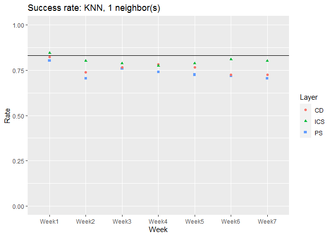
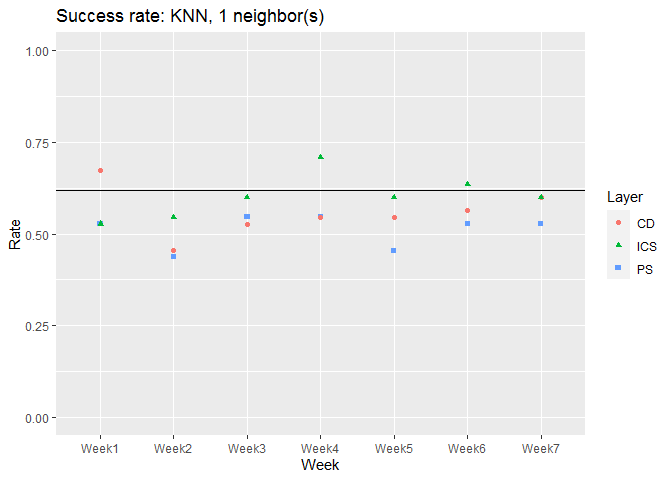
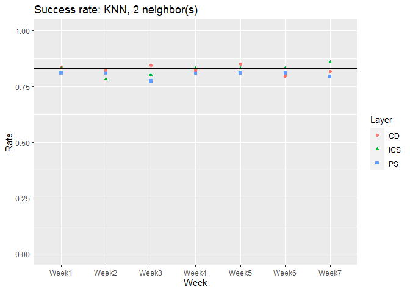
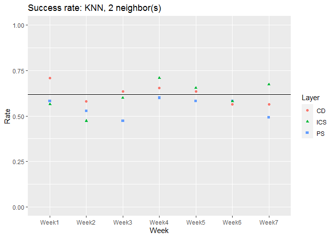
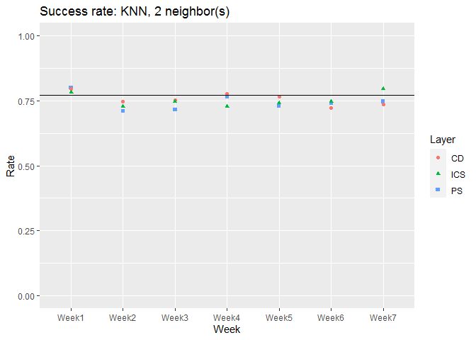
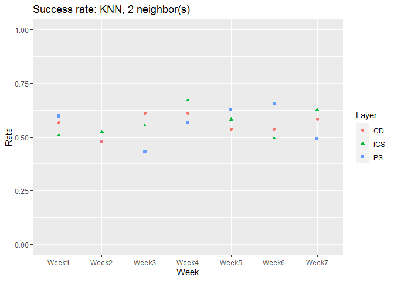

Goal for this document is to use K nearest neighbors to predict passing and just-passing in the (single-layer) PS, CD, and ICS weekly networks. Calculate success rates for each week and save.

**Update 8/18:** Starting this file to document calculations I worked out in `passfail_KNN_jackknife.R`. 


## Import data

At this point, the following Rmd files have already been run: `loadAllNetworks`, `calculatePR_TE_H`, and `make_node_data_frames`. Importing the results of that gives me three long data frames. Each has all the node info and centrality values, by week, for a single layer. 


```r
(load("../data/centrality_data_frames.Rdata"))
```

```
## [1] "dfPS"      "dfCD"      "dfICS"     "nPass"     "nJustPass"
```


## Jackknife K nearest neighbors

Because of the data set size, we'll use a "jackknife" approach, where each observation is removed, the remaining observations are used to predict the missing one, and then we repeat until we've checked them all. 

Turn the long data frames into lists of single (weekly) data frames: 


```r
centPS <- dfPS %>% group_split(Week)
centCD <- dfCD %>% group_split(Week)
centICS <- dfICS %>% group_split(Week)

centPS[[1]]
```

```
## # A tibble: 166 x 17
##    Week  name  grade gender   age cohort   sog fci_pre fci_pre_0 fci_pre_s
##    <fct> <chr> <int>  <int> <int>  <int> <dbl>   <dbl>     <dbl>     <dbl>
##  1 1     Pers~     2      1    19      3     6      17        17        17
##  2 1     Pers~    -3      1    20     10    NA      NA         0         6
##  3 1     Pers~     0      1    22     10     9      NA         0        15
##  4 1     Pers~     4      1    19      6    20      28        28        28
##  5 1     Pers~     2      1    27      1     7      26        26        26
##  6 1     Pers~     4      1    20      2     0      18        18        18
##  7 1     Pers~     0      1    19     10    11      NA         0        15
##  8 1     Pers~     7      1    20      2    NA      15        15        15
##  9 1     Pers~    12      1   100      4    NA      26        26        26
## 10 1     Pers~     7      1    20      3    11      13        13        13
## # ... with 156 more rows, and 7 more variables: fci_pre_c <dbl>, pass <fct>,
## #   justpass <fct>, Week.1 <int>, PageRank <dbl>, tarEnt <dbl>, Hide <dbl>
```

### Jackknife loop

Next, the function that actually does the calculations. 

* Input: A list of weekly data frames, optional outcome (pass/justpass, defaults to "pass"), and an optional subset of predictors to use (defaults gender, cohort, FCI pre, and centrality)
* Output: A list with two items. The first is the number of neighbors used (`nK`); the second is a data frame with node names, pass/fail outcome, and prediction vectors for that weekly aggregate network. Each node is predicted using all the other nodes in its week.


```r
jackPred <- function(layer, nK = 1, outcome = "pass", 
                     predictors = c("gender", "cohort", "fci_pre", "PageRank", 
                                    "tarEnt", "Hide")) {
  if (outcome == "pass" | outcome == "justpass") {
    choices <- c("0", "1")
  } else {
    stop("Not a valid outcome variable.")
  }
  
  # Input data (complete cases) and empty frame to store predictions 
  Nlayer <- length(layer)
  userows <- complete.cases(layer[[Nlayer]][, c(outcome, predictors)])  
  allpred <- matrix(nrow = sum(userows), ncol = Nlayer)
  
  # Build fitting input string using predictor names
  fitStr <- paste(predictors, collapse = " + ")
  fitForm <- paste0(outcome, " ~ ", fitStr)

  # Loop through all weeks
  for(j in seq(Nlayer)) {
    data <- layer[[j]][userows, c(outcome, predictors)] # data is complete cases
    
    # Loop through all nodes
    for(i in 1:dim(data)[1]) {
      # training set is data minus observation i
      # Predictor matrices for training and test data
      train <- as.matrix(data[-i, predictors])
      test <- as.matrix(data[i, predictors])
      
      # Outcome vectors for training and test data
      # Can't just do data[-i, outcome], for explanation see
      # https://stackoverflow.com/questions/51063381/vector-from-tibble-has-length-0
      trOutcome <- pull(data[-i, ], var = outcome)
      teOutcome <- pull(data[i, ], var = outcome)
      
      # Run KNN
      set.seed(2)
      # Logistic regression makes probabilities, which you translate into prediction; 
      # KNN does it all in one step
      allpred[i, j] <- knn(train, test, trOutcome, k = nK)
    }
  }
  
  # Assemble data frame: Translate factor to labels, add node names and outcomes
  allpred[allpred == 1] <- choices[1] # 0
  allpred[allpred == 2] <- choices[2] # 1
  allpred <- data.frame(layer[[1]][userows, "name"],  # node names
                        data[, outcome],            # real outcome
                        as.data.frame(allpred))     # predicted outcome
  names(allpred) <- c("name", outcome, paste0("Week", c(1:length(layer))))
  
  # Print info string and return predictions
  print(paste0("Fit: ", fitForm, ", #neighbors = ", nK, 
               ", complete N = ", dim(allpred)[1]))
  return(list(nK = nK, allpred = allpred))
}
```

It takes a few seconds to run the loop, so I'll import the results rather than executing it here. I did this for each centrality data frame (PS, CD, and ICS), using demographics (Gender/Section), FCI pretest score, and all three centrality measures as predictors. The function predicts passing if P > 0.5. 


```r
# Predict pass/fail
#predPS <- jackPred(centPS, nK = 2)
#predCD <- jackPred(centCD, nK = 2)
#predICS <- jackPred(centICS, nK = 2)

# Predict just-pass/just-fail (2/0)
#predJustPS <- jackPred(centPS, nK = 2, outcome = "justpass")
#predJustCD <- jackPred(centCD, nK = 2, outcome = "justpass")
#predJustICS <- jackPred(centICS, nK = 2, outcome = "justpass")

load("../data/jackknife_knn1_predictions.Rda")
```


### Success rates for K = 1

We're interested in a couple of success rate comparisons: how predictions compared with reality for each week, and how well it would have worked to just guess that everyone passed.

I got tired of repasting code lines (which got clunkier with the list return format in KNN), so I wrote a function to compile this. 

* Input: Three prediction data frames, outcome variable (pass/justpass)
* Output: Success rate data frame with layer name, # of neighbors (`nK`), # of nodes (`N`), weekly prediction success rates, guessing success rate


```r
getSucc <- function(pPS, pCD, pICS, outcome = "pass") {
  
  # Calculate one row of success rate table:
  # Pull weekly columns and compare them with outcome (pass/justpass)
  succRow <- function(p) sapply(p[[2]][, 3:9], 
                                function(x) mean(x == p[[2]][[outcome]]))
  
  compareSucc <- rbind(succRow(pPS), succRow(pCD), succRow(pICS))

  # Number of nodes: pull from prediction data frame
  Nnodes <- c(dim(pPS[[2]])[1], dim(pCD[[2]])[1], dim(pICS[[2]])[1])
  
  # How successful is it to just guess that everyone passes?
  Guessing  <- c(mean(pPS[[2]][[outcome]] == "1"), 
                 mean(pCD[[2]][[outcome]] == "1"),
                 mean(pICS[[2]][[outcome]] == "1"))
    
  # Package all these calculations in a data frame
  succRate <- data.frame(Layer = c("PS","CD","ICS"), 
                         nK = c(pPS[[1]], pCD[[1]], pICS[[1]]),
                         N = Nnodes, 
                         compareSucc, 
                         Guessing)
  return(succRate)
}
```

With the function made, calculate success rates for everyone, then for only the people who were on the pass/fail boundary (2/0):

```r
succRate1 <- getSucc(predPS, predCD, predICS)
succRate1
```

```
##   Layer nK   N     Week1     Week2     Week3     Week4     Week5     Week6
## 1    PS  1 142 0.8028169 0.7042254 0.7605634 0.7394366 0.7253521 0.7183099
## 2    CD  1 142 0.8239437 0.7394366 0.7676056 0.7816901 0.7676056 0.7253521
## 3   ICS  1 142 0.8450704 0.8028169 0.7887324 0.7746479 0.7887324 0.8098592
##       Week7  Guessing
## 1 0.7042254 0.8309859
## 2 0.7253521 0.8309859
## 3 0.8028169 0.8309859
```

```r
succRateJust1 <- getSucc(predJustPS, predJustCD, predJustICS, "justpass")
succRateJust1
```

```
##   Layer nK  N     Week1     Week2     Week3     Week4     Week5     Week6
## 1    PS  1 55 0.5272727 0.4363636 0.5454545 0.5454545 0.4545455 0.5272727
## 2    CD  1 55 0.6727273 0.4545455 0.5272727 0.5454545 0.5454545 0.5636364
## 3   ICS  1 55 0.5272727 0.5454545 0.6000000 0.7090909 0.6000000 0.6363636
##       Week7  Guessing
## 1 0.5272727 0.6181818
## 2 0.6000000 0.6181818
## 3 0.6000000 0.6181818
```

### Success rates for K = 2

Import the `nK = 2` data and calculate the new success rates. Note that this overwrites the prediction objects (`predPS`, `predJustPS`, etc.), so I'll need to be careful about order if I want to do any more calculations with the earlier data.

```r
load("../data/jackknife_knn2_predictions.Rda")
```

Success rates:

```r
succRate2 <- getSucc(predPS, predCD, predICS)
succRate2
```

```
##   Layer nK   N     Week1     Week2     Week3     Week4     Week5     Week6
## 1    PS  2 142 0.8098592 0.8098592 0.7746479 0.8098592 0.8098592 0.8098592
## 2    CD  2 142 0.8380282 0.8239437 0.8450704 0.8239437 0.8521127 0.7957746
## 3   ICS  2 142 0.8309859 0.7816901 0.8028169 0.8309859 0.8309859 0.8309859
##       Week7  Guessing
## 1 0.7957746 0.8309859
## 2 0.8169014 0.8309859
## 3 0.8591549 0.8309859
```

```r
succRateJust2 <- getSucc(predJustPS, predJustCD, predJustICS, "justpass")
succRateJust2
```

```
##   Layer nK  N     Week1     Week2     Week3     Week4     Week5     Week6
## 1    PS  2 55 0.5818182 0.5272727 0.4727273 0.6000000 0.5818182 0.5818182
## 2    CD  2 55 0.7090909 0.5818182 0.6363636 0.6545455 0.6363636 0.5636364
## 3   ICS  2 55 0.5636364 0.4727273 0.6000000 0.7090909 0.6545455 0.5818182
##       Week7  Guessing
## 1 0.4909091 0.6181818
## 2 0.5636364 0.6181818
## 3 0.6727273 0.6181818
```

### Success rates for no-FCI calculations

What if we ignore `FCIpre`? It's the biggest contributor to missing data here. Again, I'll comment out the calculations and import the results.


```r
predict_noFCI <- c("gender", "cohort", "PageRank", "tarEnt", "Hide")

# All pass/fail
#predPSnoFCI <-jackPred(centPS, nK = 2, predictors = predict_noFCI)
#predCDnoFCI <-jackPred(centCD, nK = 2, predictors = predict_noFCI)
#predICSnoFCI <-jackPred(centICS, nK = 2, predictors = predict_noFCI)

# Just-pass/just-fail (2/0)
#predJustPSnoFCI <- jackPred(centPS, nK = 2, outcome = "justpass", 
#                            predictors = predict_noFCI)
#predJustCDnoFCI <- jackPred(centCD, nK = 2, outcome = "justpass", 
#                            predictors = predict_noFCI)
#predJustICSnoFCI <- jackPred(centICS, nK = 2, outcome = "justpass", 
#                             predictors = predict_noFCI)

load("../data/jackknife_knn2_noFCI_predictions.Rda")
```

Calculating the success rate tables uses the same function as above:

```r
succRatenoFCI2 <- getSucc(predPSnoFCI, predCDnoFCI, predICSnoFCI, "pass")
succRateJustnoFCI2 <- getSucc(predJustPSnoFCI, predJustCDnoFCI, 
                              predJustICSnoFCI, "justpass")

succRatenoFCI2
```

```
##   Layer nK   N     Week1     Week2     Week3     Week4     Week5     Week6
## 1    PS  2 166 0.8012048 0.7108434 0.7168675 0.7650602 0.7289157 0.7409639
## 2    CD  2 166 0.7951807 0.7469880 0.7530120 0.7771084 0.7650602 0.7228916
## 3   ICS  2 166 0.7831325 0.7289157 0.7469880 0.7289157 0.7409639 0.7469880
##       Week7  Guessing
## 1 0.7469880 0.7710843
## 2 0.7349398 0.7710843
## 3 0.7951807 0.7710843
```

```r
succRateJustnoFCI2
```

```
##   Layer nK  N     Week1     Week2     Week3     Week4     Week5     Week6
## 1    PS  2 67 0.5970149 0.4776119 0.4328358 0.5671642 0.6268657 0.6567164
## 2    CD  2 67 0.5671642 0.4776119 0.6119403 0.6119403 0.5373134 0.5373134
## 3   ICS  2 67 0.5074627 0.5223881 0.5522388 0.6716418 0.5820896 0.4925373
##       Week7  Guessing
## 1 0.4925373 0.5820896
## 2 0.5820896 0.5820896
## 3 0.6268657 0.5820896
```


## Summary of results

The success rate tables have the punchline here. If the success rate for a given week and layer is higher than the value in the last column (the "assume everyone passes" default classifier), that's good news. 

### `K = 1` and `K = 2`, all predictors

Doing a quick boolean comparison,

```r
succRate1[, c(4:10)] > succRate1[1, 11]
```

```
##      Week1 Week2 Week3 Week4 Week5 Week6 Week7
## [1,] FALSE FALSE FALSE FALSE FALSE FALSE FALSE
## [2,] FALSE FALSE FALSE FALSE FALSE FALSE FALSE
## [3,]  TRUE FALSE FALSE FALSE FALSE FALSE FALSE
```

```r
rowSums(succRate1[, c(4:10)] > succRate1[1, 11])
```

```
## [1] 0 0 1
```

KNN with one neighbor does worse than guessing everyone passes, most of the time. 


```r
succRate2[, c(4:10)] > succRate2[1, 11]
```

```
##      Week1 Week2 Week3 Week4 Week5 Week6 Week7
## [1,] FALSE FALSE FALSE FALSE FALSE FALSE FALSE
## [2,]  TRUE FALSE  TRUE FALSE  TRUE FALSE FALSE
## [3,] FALSE FALSE FALSE FALSE FALSE FALSE  TRUE
```

```r
rowSums(succRate2[, c(4:10)] > succRate2[1, 11])
```

```
## [1] 0 3 1
```

For two neighbors, the situation is a bit better for the CD network, but otherwise the same.

For grades on the boundary, 


```r
succRateJust1[, c(4:10)] > succRateJust1[1, 11]
```

```
##      Week1 Week2 Week3 Week4 Week5 Week6 Week7
## [1,] FALSE FALSE FALSE FALSE FALSE FALSE FALSE
## [2,]  TRUE FALSE FALSE FALSE FALSE FALSE FALSE
## [3,] FALSE FALSE FALSE  TRUE FALSE  TRUE FALSE
```

```r
rowSums(succRateJust1[, c(4:10)] > succRateJust1[1, 11])
```

```
## [1] 0 1 2
```

```r
succRateJust2[, c(4:10)] > succRateJust2[1, 11]
```

```
##      Week1 Week2 Week3 Week4 Week5 Week6 Week7
## [1,] FALSE FALSE FALSE FALSE FALSE FALSE FALSE
## [2,]  TRUE FALSE  TRUE  TRUE  TRUE FALSE FALSE
## [3,] FALSE FALSE FALSE  TRUE  TRUE FALSE  TRUE
```

```r
rowSums(succRateJust2[, c(4:10)] > succRateJust2[1, 11])
```

```
## [1] 0 4 3
```

```r
(succRateJust2[, c(4:10)] - succRateJust2[1, 11]) * 100
```

```
##       Week1      Week2      Week3     Week4     Week5     Week6      Week7
## 1 -3.636364  -9.090909 -14.545455 -1.818182 -3.636364 -3.636364 -12.727273
## 2  9.090909  -3.636364   1.818182  3.636364  1.818182 -5.454545  -5.454545
## 3 -5.454545 -14.545455  -1.818182  9.090909  3.636364 -3.636364   5.454545
```

Things are only marginally better for the justpass criterion. Week 4 actually seems to be the high point. Even more than logistic regression, the K nearest neighbors classifier isn't improving as weekly data accumulates. 

### `K = 1` and `K = 2`, no FCI

Same deal as above, with the no-FCI success rates:

```r
succRatenoFCI2[, c(4:10)] > succRatenoFCI2[1, 11]
```

```
##      Week1 Week2 Week3 Week4 Week5 Week6 Week7
## [1,]  TRUE FALSE FALSE FALSE FALSE FALSE FALSE
## [2,]  TRUE FALSE FALSE  TRUE FALSE FALSE FALSE
## [3,]  TRUE FALSE FALSE FALSE FALSE FALSE  TRUE
```

```r
rowSums(succRatenoFCI2[, c(4:10)] > succRatenoFCI2[1, 11])
```

```
## [1] 1 2 2
```

```r
succRateJustnoFCI2[, c(4:10)] > succRateJustnoFCI2[1, 11]
```

```
##      Week1 Week2 Week3 Week4 Week5 Week6 Week7
## [1,]  TRUE FALSE FALSE FALSE  TRUE  TRUE FALSE
## [2,] FALSE FALSE  TRUE  TRUE FALSE FALSE FALSE
## [3,] FALSE FALSE FALSE  TRUE FALSE FALSE  TRUE
```

```r
rowSums(succRateJustnoFCI2[, c(4:10)] > succRateJustnoFCI2[1, 11])
```

```
## [1] 3 2 2
```

Again, there's not a big show of improvement for later weeks; again week 1 or week 4 are the best showings. 


### Plotting success rates

To more easily compare, I'd like to plot this too. 


```r
plotSucc <- function(succRate) {
  dflong <- succRate %>% 
    pivot_longer(Week1:Week7, names_to = "Week", values_to = "Rate")
  
  plotlab <- paste0("Success rate: KNN, ", median(succRate$nK), " neighbor(s)")

  ggplot(data = dflong, mapping = aes(x = Week, y = Rate)) + 
    geom_point(mapping = aes(color = Layer, shape = Layer)) + 
    geom_hline(aes(yintercept = Guessing)) + 
    ylim(0, 1) + 
    labs(title = plotlab)
}

plotSucc(succRate1)
```

<!-- -->

```r
plotSucc(succRateJust1)
```

<!-- -->

```r
plotSucc(succRate2)
```

<!-- -->

```r
plotSucc(succRateJust2)
```

<!-- -->

And the no-FCI plots too:

```r
plotSucc(succRatenoFCI2)
```

<!-- -->

```r
plotSucc(succRateJustnoFCI2)
```

<!-- -->

