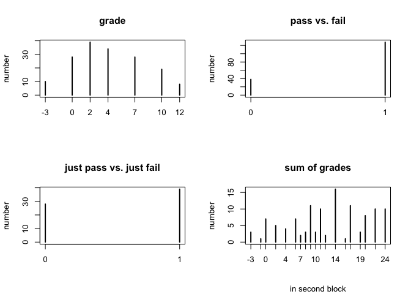
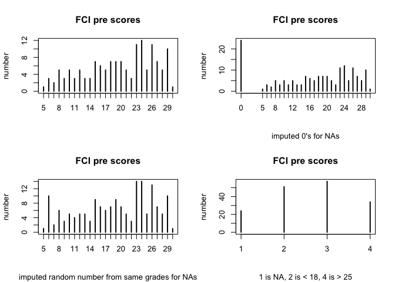
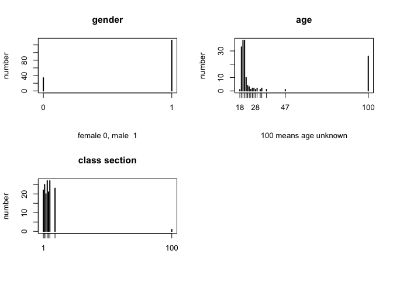
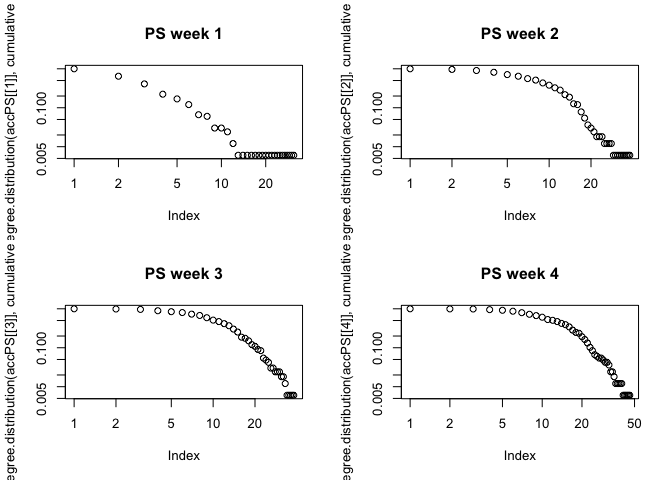
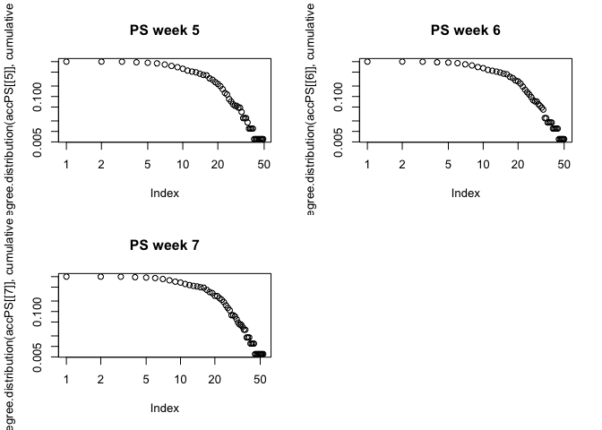
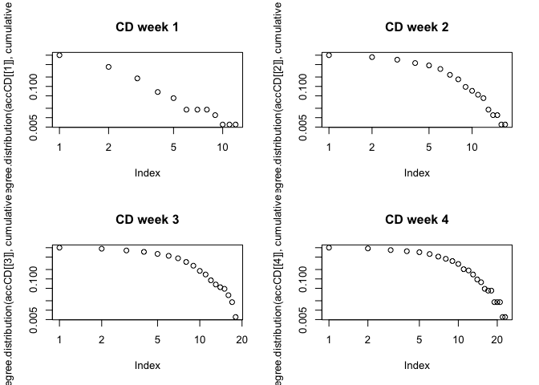
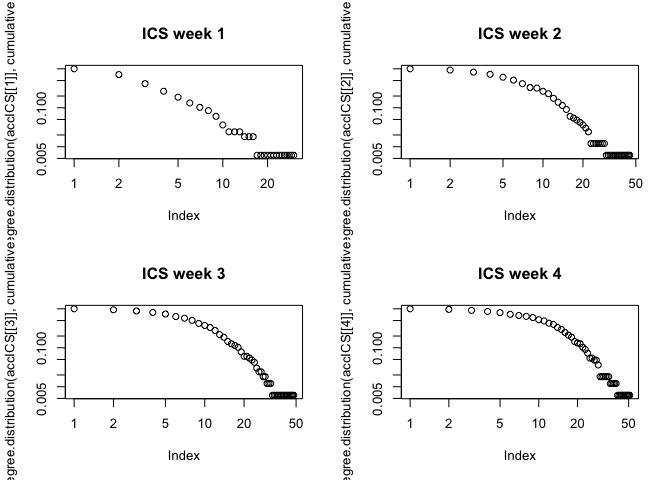
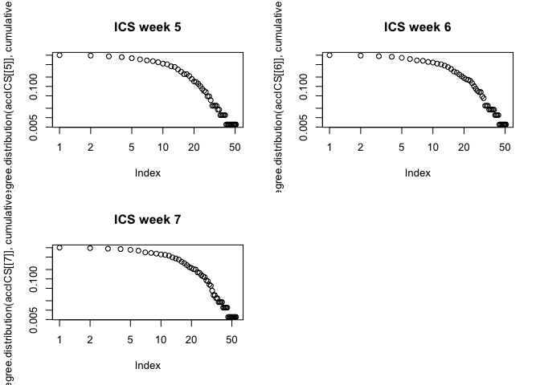

Load and accumulate networks
================
Adrienne Traxler & Jesper Bruun
3/28/2020

This document is part of the supplemental material for the paper:
sample(Traxler, A. & Bruun, J.) (202x) Classifying Passing and Failing
xxx . JOURNAL. DOI.

This markdown takes you through the R-script, “loadAllNetworks.r”. The
purpose of the script is use the igraph package to load and prepare the
networks on which we will perform our analyses. Moreover, the script
attaches attributes to the network, such as gender, grades and fci-pre
test scores. The pre-test scores includes NAs from students who did not
answer them. We employ different strategies for dealing with this. We
load networks for each week separately, and we also add networks per
week. In adding networks per week, we create accumulated networks; an
accumulated network for week 2 is obtained by adding links from week 2
to week 1. The accumulated network for week 3 then adds links from week
3 to the accumulated network of week 2 and so on.

    ## 
    ## Attaching package: 'igraph'

    ## The following objects are masked from 'package:stats':
    ## 
    ##     decompose, spectrum

    ## The following object is masked from 'package:base':
    ## 
    ##     union

## Loading attributes

Apart from the networks, the data set includes a number of attributes.
We start by loading these.

``` r
###Loading node attributes###
##These will be attached to networks as node attributes later###

attributes<-read.csv("data/SNA_ESERA2013.csv")
FCI_PRE<-c(17,NA,NA,28,26,18,NA,15,26,13,30,27,23,20,27,24,24,15,24,19,9,5,14,28,16,29,NA,
           19,NA,27,NA,9,17,12,NA,29,29,NA,24,8,NA,15,18,NA,21,NA,12,28,18,16,NA,NA,NA,27,
           24,23,NA,13,16,26,10,23,25,22,NA,29,6,10,NA,23,NA,NA,29,21,26,NA,24,17,15,NA,20,
           23,25,27,NA,11,15,NA,29,NA,12,20,10,20,9,17,26,22,NA,NA,23,24,NA,18,7,25,16,19,
           23,27,29,23,22,NA,7,17,NA,24,25,6,26,NA,19,21,14,23,28,13,NA,24,19,19,10,NA,24,
           NA,26,12,27,18,29,12,27,23,28,11,14,NA,23,NA,16,21,26,8,20,NA,NA,19,10,15,29,NA,
           6,18,NA,8,20,26,8,NA,25,18,20,8,NA,15,16,NA,26,26,21,29,NA,11,NA,24,24)
SOG<-c(6,NA,9,20,7,0,11,NA,NA,11,24,NA,NA,20,10,9,6,14,14,17,NA,17,10,NA,NA,22,NA,NA,22,8,
       24,11,6,NA,NA,24,24,NA,20,14,NA,14,-1,NA,16,NA,NA,24,NA,6,NA,NA,NA,22,22,22,NA,-3,11,
       NA,NA,-3,7,NA,NA,22,NA,4,NA,20,NA,NA,NA,12,14,NA,14,NA,14,NA,17,NA,14,17,NA,6,0,9,NA,
       22,9,14,14,NA,-3,NA,24,2,NA,NA,14,8,19,NA,NA,11,17,20,24,24,6,NA,10,NA,NA,
       11,4,20,NA,9,17,2,22,2,22,14,11,6,NA,NA,2,NA,9,0,0,0,22,NA,0,19,17,NA,22,11,14,4,8,NA,
       NA,NA,17,9,20,NA,9,NA,NA,NA,4,NA,17,NA,NA,17,NA,12,11,20,19,NA,9,NA,11,2,NA,9,17,NA,9,
       14,14,24,NA,0,14,24,NA)
```

Now, we preprocess some of the attributes. The FCI-data has a number of
NAs, and R will as a standard exclude these from calculations. An NA
means that the student did not fill out the FCI pre-test. However, this
filling out was done in lab-classes of \~30 students and – We employ
three strategies to impute different meanings to these NAs. The first
strategy is to impute 0 for each NA. The second is to impute a random
score chosen from the scores from students who achieved the same grade
as the student in question. The third strategy is part of a
categorisation-strategy. All NAs put in one category, while scores are
put in three different categories based on Halloun & Hestenes (1995).

``` r
#New FCI_PRE attribute, where NAs are set to zero.
FCI_PRE_0<-FCI_PRE
FCI_PRE_0[is.na(FCI_PRE_0)]<-0

#New FCI_PRE attribute where NAs are replaced by a sample
FCI_PRE_S<-FCI_PRE
FCI_PRE_S[is.na(FCI_PRE) & attributes$Course.Grade==-3]<-sample(FCI_PRE[!is.na(FCI_PRE) 
                                                      & attributes$Course.Grade==-3],1)
FCI_PRE_S[is.na(FCI_PRE)& attributes$Course.Grade==0]<-sample(FCI_PRE[!is.na(FCI_PRE)
                                                      & attributes$Course.Grade==0],8)
FCI_PRE_S[is.na(FCI_PRE)& attributes$Course.Grade==2]<-sample(FCI_PRE[!is.na(FCI_PRE)
                                                      & attributes$Course.Grade==2],5)
FCI_PRE_S[is.na(FCI_PRE)& attributes$Course.Grade==4]<-sample(FCI_PRE[!is.na(FCI_PRE)
                                                      & attributes$Course.Grade==4],1)
FCI_PRE_S[is.na(FCI_PRE)& attributes$Course.Grade==7]<-sample(FCI_PRE[!is.na(FCI_PRE)
                                                      & attributes$Course.Grade==7],3)
FCI_PRE_S[is.na(FCI_PRE)& attributes$Course.Grade==10]<-sample(FCI_PRE[!is.na(FCI_PRE)
                                                      & attributes$Course.Grade==10],1)

attributes$Course.Grade[attributes$Course.Grade==100]<-NA #R counts NA in the above...
#New FCI_PRE attribute, where we make four classes. Three based on score and 1 based on NAs. 
#Classification based on 
#Halloun & Hestenes 1995 (Interpreting the Force Concept Inventory): 
#http://modeling.asu.edu/R&E/InterFCI.pdf 
#NA is Class 1. Below 60% correct (17 or less) is Class 2, "below entry level" 
#(see p. 6 in H&H). Between 60% and 85% (17-25) is "entry level". Above 85% (26) is expert. 
FCI_PRE_C<-vector()
FCI_PRE_C[is.na(FCI_PRE)]<-1
FCI_PRE_C[FCI_PRE<18]<-2
FCI_PRE_C[FCI_PRE>=18 & FCI_PRE<=25]<-3
FCI_PRE_C[FCI_PRE>25]<-4
```

Next, since we will be analysing passing and failing the course, we
create a new attribute based on the course grade. The grade 2 is the
minimum passing grade. We make a distinction between passing (grades 2,
4, 7, 10, 12) vs failing (-3, 0) and just passing vs just failing (2
vs. 0).

``` r
PASS<-vector(length = 187)
PASS[attributes$Course.Grade<2]<-0
PASS[attributes$Course.Grade>=2]<-1
JUSTPASS<-vector(length=187)
JUSTPASS<-NA
JUSTPASS[attributes$Course.Grade==0]<-0
JUSTPASS[attributes$Course.Grade==2]<-1
```

We append the new attributes to the attributes data frame.

``` r
attributes$fci_pre<-FCI_PRE
attributes$fci_pre_0<-FCI_PRE_0
attributes$fci_pre_s<-FCI_PRE_S
attributes$fci_pre_c<-FCI_PRE_C
attributes$sog<-SOG
attributes$pass<-PASS
attributes$justpass<-JUSTPASS
```

## Loading networks

Networks are loaded in subfolders of the data/networks folder. Is in
Bruun & Brewe (2013), we use networks in which links signify
communication about problems solving (PS), conceptual discussions (CD),
and in-class social interactions (ICS). Here we load and display the
networks for each of the weeks for which we have data. Networks are
loaded into arrays per type.

``` r
# Import PS weekly networks
dirs <- list.files("data/networks/")
files <- c("week36-37physStandQ1.net","AnonymousWeek38physStandQ1.net",
           "week39physStandQ1.net","week40physStandQ1.net","week42physStandQ1.net",
           "week43physStandQ1.net","week44physQ1Standardized.net")
paths <- paste("data/networks",dirs,files,sep="/")
weeksPS <- lapply(paths,read.graph,format="pajek")
names(weeksPS) <- c("week36-37","week38","week39","week40","week42","week43","week44")
weeksPS
```

    ## $`week36-37`
    ## IGRAPH 4d3aa23 DNW- 187 269 -- 
    ## + attr: id (v/c), name (v/c), weight (e/n)
    ## + edges from 4d3aa23 (vertex names):
    ##  [1] Person33 ->Person50  Person33 ->Person121 Person160->Person94 
    ##  [4] Person160->Person178 Person95 ->Person25  Person95 ->Person42 
    ##  [7] Person28 ->Person8   Person28 ->Person56  Person28 ->Person75 
    ## [10] Person28 ->Person84  Person28 ->Person92  Person28 ->Person107
    ## [13] Person28 ->Person133 Person28 ->Person164 Person28 ->Person169
    ## [16] Person133->Person13  Person133->Person22  Person133->Person28 
    ## [19] Person133->Person56  Person133->Person64  Person133->Person84 
    ## [22] Person133->Person85  Person133->Person107 Person133->Person126
    ## + ... omitted several edges
    ## 
    ## $week38
    ## IGRAPH d033d68 DNW- 187 971 -- 
    ## + attr: id (v/c), name (v/c), weight (e/n)
    ## + edges from d033d68 (vertex names):
    ##  [1] Person33->Person101 Person33->Person131 Person40->Person124
    ##  [4] Person40->Person167 Person13->Person11  Person13->Person109
    ##  [7] Person13->Person110 Person13->Person113 Person13->Person127
    ## [10] Person13->Person135 Person13->Person153 Person13->Person171
    ## [13] Person79->Person10  Person79->Person56  Person79->Person88 
    ## [16] Person79->Person106 Person79->Person111 Person79->Person123
    ## [19] Person79->Person153 Person79->Person164 Person79->Person168
    ## [22] Person79->Person180 Person56->Person10  Person56->Person22 
    ## + ... omitted several edges
    ## 
    ## $week39
    ## IGRAPH d4543d6 DNW- 187 703 -- 
    ## + attr: id (v/c), name (v/c), weight (e/n)
    ## + edges from d4543d6 (vertex names):
    ##  [1] Person172->Person94  Person172->Person115 Person172->Person149
    ##  [4] Person172->Person187 Person85 ->Person160 Person24 ->Person137
    ##  [7] Person24 ->Person154 Person24 ->Person159 Person24 ->Person187
    ## [10] Person56 ->Person66  Person56 ->Person153 Person56 ->Person164
    ## [13] Person146->Person108 Person33 ->Person50  Person33 ->Person101
    ## [16] Person33 ->Person108 Person33 ->Person131 Person33 ->Person158
    ## [19] Person38 ->Person4   Person38 ->Person5   Person38 ->Person66 
    ## [22] Person38 ->Person92  Person38 ->Person121 Person38 ->Person131
    ## + ... omitted several edges
    ## 
    ## $week40
    ## IGRAPH 540c257 DNW- 187 656 -- 
    ## + attr: id (v/c), name (v/c), weight (e/n)
    ## + edges from 540c257 (vertex names):
    ##  [1] Person50 ->Person78  Person50 ->Person106 Person50 ->Person123
    ##  [4] Person50 ->Person131 Person50 ->Person167 Person40 ->Person32 
    ##  [7] Person40 ->Person50  Person40 ->Person108 Person40 ->Person125
    ## [10] Person40 ->Person147 Person40 ->Person167 Person146->Person33 
    ## [13] Person32 ->Person40  Person32 ->Person54  Person32 ->Person102
    ## [16] Person32 ->Person108 Person32 ->Person118 Person32 ->Person167
    ## [19] Person180->Person4   Person180->Person15  Person180->Person66 
    ## [22] Person180->Person79  Person180->Person88  Person180->Person123
    ## + ... omitted several edges
    ## 
    ## $week42
    ## IGRAPH 80e2e05 DNW- 187 335 -- 
    ## + attr: id (v/c), name (v/c), weight (e/n)
    ## + edges from 80e2e05 (vertex names):
    ##  [1] Person34 ->Person9   Person34 ->Person99  Person34 ->Person119
    ##  [4] Person121->Person4   Person121->Person58  Person121->Person66 
    ##  [7] Person121->Person86  Person121->Person93  Person121->Person101
    ## [10] Person121->Person131 Person121->Person134 Person121->Person139
    ## [13] Person146->Person86  Person146->Person158 Person146->Person180
    ## [16] Person33 ->Person32  Person33 ->Person101 Person33 ->Person121
    ## [19] Person33 ->Person124 Person33 ->Person131 Person33 ->Person178
    ## [22] Person40 ->Person5   Person40 ->Person18  Person40 ->Person19 
    ## + ... omitted several edges
    ## 
    ## $week43
    ## IGRAPH 063ce3d DNW- 187 420 -- 
    ## + attr: id (v/c), name (v/c), weight (e/n)
    ## + edges from 063ce3d (vertex names):
    ##  [1] Person121->Person4   Person121->Person58  Person121->Person63 
    ##  [4] Person121->Person66  Person121->Person93  Person121->Person95 
    ##  [7] Person121->Person101 Person121->Person131 Person121->Person134
    ## [10] Person121->Person139 Person33 ->Person32  Person33 ->Person63 
    ## [13] Person33 ->Person101 Person33 ->Person121 Person33 ->Person124
    ## [16] Person33 ->Person131 Person33 ->Person178 Person50 ->Person40 
    ## [19] Person50 ->Person41  Person50 ->Person106 Person50 ->Person123
    ## [22] Person50 ->Person131 Person4  ->Person5   Person4  ->Person66 
    ## + ... omitted several edges
    ## 
    ## $week44
    ## IGRAPH e4e9753 DNW- 187 437 -- 
    ## + attr: id (v/c), name (v/c), weight (e/n)
    ## + edges from e4e9753 (vertex names):
    ##  [1] Person158->Person5   Person158->Person63  Person158->Person78 
    ##  [4] Person158->Person101 Person158->Person131 Person158->Person168
    ##  [7] Person121->Person4   Person121->Person33  Person121->Person66 
    ## [10] Person121->Person101 Person121->Person131 Person33 ->Person4  
    ## [13] Person33 ->Person63  Person33 ->Person66  Person33 ->Person101
    ## [16] Person33 ->Person121 Person33 ->Person131 Person33 ->Person178
    ## [19] Person56 ->Person22  Person56 ->Person118 Person56 ->Person133
    ## [22] Person56 ->Person153 Person56 ->Person164 Person56 ->Person180
    ## + ... omitted several edges

``` r
# Import networks from their various directories
dirs <- list.files("data/networks/")
files <- c("week36-37physStandQ2.net","AnonymousWeek38physStandQ2.net",
           "week39physStandQ2.net","week40physStandQ2.net","week42physStandQ2.net",
           "week43physStandQ2.net","week44physQ2Standardized.net")
paths <- paste("data/networks",dirs,files,sep="/")
weeksCD <- lapply(paths,read.graph,format="pajek")
names(weeksCD) <- c("week36-37","week38","week39","week40","week42","week43","week44")
weeksCD
```

    ## $`week36-37`
    ## IGRAPH 61b5118 DNW- 187 269 -- 
    ## + attr: id (v/c), name (v/c), weight (e/n)
    ## + edges from 61b5118 (vertex names):
    ##  [1] Person33 ->Person50  Person33 ->Person121 Person160->Person94 
    ##  [4] Person160->Person178 Person95 ->Person25  Person95 ->Person42 
    ##  [7] Person28 ->Person8   Person28 ->Person56  Person28 ->Person75 
    ## [10] Person28 ->Person84  Person28 ->Person92  Person28 ->Person107
    ## [13] Person28 ->Person133 Person28 ->Person164 Person28 ->Person169
    ## [16] Person133->Person13  Person133->Person22  Person133->Person28 
    ## [19] Person133->Person56  Person133->Person64  Person133->Person84 
    ## [22] Person133->Person85  Person133->Person107 Person133->Person126
    ## + ... omitted several edges
    ## 
    ## $week38
    ## IGRAPH b622eaf DNW- 187 971 -- 
    ## + attr: id (v/c), name (v/c), weight (e/n)
    ## + edges from b622eaf (vertex names):
    ##  [1] Person33->Person101 Person33->Person131 Person40->Person124
    ##  [4] Person40->Person167 Person13->Person11  Person13->Person109
    ##  [7] Person13->Person110 Person13->Person113 Person13->Person127
    ## [10] Person13->Person135 Person13->Person153 Person13->Person171
    ## [13] Person79->Person10  Person79->Person56  Person79->Person88 
    ## [16] Person79->Person106 Person79->Person111 Person79->Person123
    ## [19] Person79->Person153 Person79->Person164 Person79->Person168
    ## [22] Person79->Person180 Person56->Person10  Person56->Person22 
    ## + ... omitted several edges
    ## 
    ## $week39
    ## IGRAPH fd23886 DNW- 187 703 -- 
    ## + attr: id (v/c), name (v/c), weight (e/n)
    ## + edges from fd23886 (vertex names):
    ##  [1] Person172->Person94  Person172->Person115 Person172->Person149
    ##  [4] Person172->Person187 Person85 ->Person160 Person24 ->Person137
    ##  [7] Person24 ->Person154 Person24 ->Person159 Person24 ->Person187
    ## [10] Person56 ->Person66  Person56 ->Person153 Person56 ->Person164
    ## [13] Person146->Person108 Person33 ->Person50  Person33 ->Person101
    ## [16] Person33 ->Person108 Person33 ->Person131 Person33 ->Person158
    ## [19] Person38 ->Person4   Person38 ->Person5   Person38 ->Person66 
    ## [22] Person38 ->Person92  Person38 ->Person121 Person38 ->Person131
    ## + ... omitted several edges
    ## 
    ## $week40
    ## IGRAPH 65abe24 DNW- 187 656 -- 
    ## + attr: id (v/c), name (v/c), weight (e/n)
    ## + edges from 65abe24 (vertex names):
    ##  [1] Person50 ->Person78  Person50 ->Person106 Person50 ->Person123
    ##  [4] Person50 ->Person131 Person50 ->Person167 Person40 ->Person32 
    ##  [7] Person40 ->Person50  Person40 ->Person108 Person40 ->Person125
    ## [10] Person40 ->Person147 Person40 ->Person167 Person146->Person33 
    ## [13] Person32 ->Person40  Person32 ->Person54  Person32 ->Person102
    ## [16] Person32 ->Person108 Person32 ->Person118 Person32 ->Person167
    ## [19] Person180->Person4   Person180->Person15  Person180->Person66 
    ## [22] Person180->Person79  Person180->Person88  Person180->Person123
    ## + ... omitted several edges
    ## 
    ## $week42
    ## IGRAPH 75a5b9f DNW- 187 335 -- 
    ## + attr: id (v/c), name (v/c), weight (e/n)
    ## + edges from 75a5b9f (vertex names):
    ##  [1] Person34 ->Person9   Person34 ->Person99  Person34 ->Person119
    ##  [4] Person121->Person4   Person121->Person58  Person121->Person66 
    ##  [7] Person121->Person86  Person121->Person93  Person121->Person101
    ## [10] Person121->Person131 Person121->Person134 Person121->Person139
    ## [13] Person146->Person86  Person146->Person158 Person146->Person180
    ## [16] Person33 ->Person32  Person33 ->Person101 Person33 ->Person121
    ## [19] Person33 ->Person124 Person33 ->Person131 Person33 ->Person178
    ## [22] Person40 ->Person5   Person40 ->Person18  Person40 ->Person19 
    ## + ... omitted several edges
    ## 
    ## $week43
    ## IGRAPH 0cddbef DNW- 187 420 -- 
    ## + attr: id (v/c), name (v/c), weight (e/n)
    ## + edges from 0cddbef (vertex names):
    ##  [1] Person121->Person4   Person121->Person58  Person121->Person63 
    ##  [4] Person121->Person66  Person121->Person93  Person121->Person95 
    ##  [7] Person121->Person101 Person121->Person131 Person121->Person134
    ## [10] Person121->Person139 Person33 ->Person32  Person33 ->Person63 
    ## [13] Person33 ->Person101 Person33 ->Person121 Person33 ->Person124
    ## [16] Person33 ->Person131 Person33 ->Person178 Person50 ->Person40 
    ## [19] Person50 ->Person41  Person50 ->Person106 Person50 ->Person123
    ## [22] Person50 ->Person131 Person4  ->Person5   Person4  ->Person66 
    ## + ... omitted several edges
    ## 
    ## $week44
    ## IGRAPH 7946e13 DNW- 187 296 -- 
    ## + attr: id (v/c), name (v/c), weight (e/n)
    ## + edges from 7946e13 (vertex names):
    ##  [1] Person158->Person5   Person158->Person78  Person158->Person101
    ##  [4] Person158->Person168 Person121->Person4   Person121->Person66 
    ##  [7] Person33 ->Person4   Person33 ->Person66  Person33 ->Person101
    ## [10] Person33 ->Person121 Person33 ->Person131 Person56 ->Person118
    ## [13] Person56 ->Person133 Person56 ->Person153 Person56 ->Person164
    ## [16] Person56 ->Person169 Person56 ->Person180 Person50 ->Person158
    ## [19] Person4  ->Person5   Person4  ->Person66  Person4  ->Person121
    ## [22] Person40 ->Person54  Person40 ->Person74  Person40 ->Person108
    ## + ... omitted several edges

``` r
dirs <- list.files("data/networks/")
files <- c("week36-37socStandQ1.net","AnonymousWeek38SocStandQ1.net",
           "week39socStandQ1.net","week40socStandQ1.net","week42socStandQ1.net",
           "week43socStandQ1.net","week44socQ1Standardized.net")
paths <- paste("data/networks",dirs,files,sep="/")
weeksICS <- lapply(paths,read.graph,format="pajek")
names(weeksICS) <- c("week36-37","week38","week39","week40","week42","week43","week44")
weeksICS
```

    ## $`week36-37`
    ## IGRAPH 7215bb1 DNW- 187 328 -- 
    ## + attr: id (v/c), name (v/c), weight (e/n)
    ## + edges from 7215bb1 (vertex names):
    ##  [1] Person95 ->Person4   Person95 ->Person5   Person95 ->Person20 
    ##  [4] Person95 ->Person42  Person95 ->Person66  Person95 ->Person66 
    ##  [7] Person95 ->Person81  Person95 ->Person86  Person95 ->Person93 
    ## [10] Person95 ->Person104 Person95 ->Person111 Person95 ->Person121
    ## [13] Person95 ->Person137 Person95 ->Person166 Person95 ->Person185
    ## [16] Person95 ->Person186 Person107->Person6   Person107->Person20 
    ## [19] Person107->Person26  Person107->Person48  Person107->Person49 
    ## [22] Person107->Person56  Person76 ->Person69  Person133->Person22 
    ## + ... omitted several edges
    ## 
    ## $week38
    ## IGRAPH 1cdf0c4 DNW- 187 630 -- 
    ## + attr: id (v/c), name (v/c), weight (e/n)
    ## + edges from 1cdf0c4 (vertex names):
    ##  [1] Person33 ->Person101 Person13 ->Person11  Person13 ->Person109
    ##  [4] Person13 ->Person113 Person13 ->Person153 Person86 ->Person4  
    ##  [7] Person86 ->Person81  Person86 ->Person98  Person86 ->Person121
    ## [10] Person86 ->Person185 Person123->Person15  Person123->Person17 
    ## [13] Person123->Person125 Person123->Person144 Person123->Person168
    ## [16] Person4  ->Person5   Person4  ->Person38  Person4  ->Person66 
    ## [19] Person4  ->Person81  Person4  ->Person86  Person4  ->Person121
    ## [22] Person4  ->Person134 Person4  ->Person157 Person4  ->Person186
    ## + ... omitted several edges
    ## 
    ## $week39
    ## IGRAPH 2e76878 DNW- 187 556 -- 
    ## + attr: id (v/c), name (v/c), weight (e/n)
    ## + edges from 2e76878 (vertex names):
    ##  [1] Person172->Person18  Person172->Person96  Person172->Person187
    ##  [4] Person24 ->Person159 Person33 ->Person101 Person33 ->Person131
    ##  [7] Person146->Person8   Person38 ->Person4   Person38 ->Person5  
    ## [10] Person38 ->Person66  Person38 ->Person121 Person56 ->Person10 
    ## [13] Person56 ->Person22  Person56 ->Person37  Person56 ->Person88 
    ## [16] Person56 ->Person92  Person56 ->Person107 Person56 ->Person109
    ## [19] Person56 ->Person110 Person56 ->Person111 Person56 ->Person118
    ## [22] Person56 ->Person133 Person56 ->Person153 Person56 ->Person164
    ## + ... omitted several edges
    ## 
    ## $week40
    ## IGRAPH 8a36991 DNW- 187 650 -- 
    ## + attr: id (v/c), name (v/c), weight (e/n)
    ## + edges from 8a36991 (vertex names):
    ##  [1] Person50 ->Person106 Person50 ->Person167 Person146->Person33 
    ##  [4] Person32 ->Person8   Person32 ->Person19  Person32 ->Person54 
    ##  [7] Person32 ->Person102 Person32 ->Person118 Person32 ->Person167
    ## [10] Person78 ->Person158 Person33 ->Person101 Person33 ->Person131
    ## [13] Person180->Person10  Person180->Person22  Person180->Person56 
    ## [16] Person180->Person79  Person180->Person88  Person180->Person111
    ## [19] Person180->Person123 Person180->Person133 Person180->Person153
    ## [22] Person180->Person164 Person180->Person168 Person4  ->Person5  
    ## + ... omitted several edges
    ## 
    ## $week42
    ## IGRAPH 097b0d0 DNW- 187 228 -- 
    ## + attr: id (v/c), name (v/c), weight (e/n)
    ## + edges from 097b0d0 (vertex names):
    ##  [1] Person34 ->Person9   Person34 ->Person119 Person34 ->Person137
    ##  [4] Person33 ->Person101 Person33 ->Person121 Person33 ->Person131
    ##  [7] Person86 ->Person42  Person86 ->Person81  Person86 ->Person98 
    ## [10] Person86 ->Person103 Person86 ->Person145 Person86 ->Person164
    ## [13] Person86 ->Person166 Person86 ->Person185 Person86 ->Person186
    ## [16] Person100->Person43  Person100->Person104 Person21 ->Person61 
    ## [19] Person21 ->Person104 Person21 ->Person142 Person21 ->Person172
    ## [22] Person21 ->Person187 Person67 ->Person96  Person67 ->Person104
    ## + ... omitted several edges
    ## 
    ## $week43
    ## IGRAPH df20bb7 DNW- 187 337 -- 
    ## + attr: id (v/c), name (v/c), weight (e/n)
    ## + edges from df20bb7 (vertex names):
    ##  [1] Person121->Person4   Person121->Person66  Person121->Person95 
    ##  [4] Person121->Person101 Person121->Person131 Person121->Person134
    ##  [7] Person33 ->Person101 Person33 ->Person121 Person33 ->Person131
    ## [10] Person146->Person33  Person146->Person121 Person146->Person158
    ## [13] Person4  ->Person66  Person4  ->Person95  Person4  ->Person121
    ## [16] Person4  ->Person134 Person4  ->Person139 Person4  ->Person143
    ## [19] Person123->Person168 Person86 ->Person81  Person86 ->Person98 
    ## [22] Person86 ->Person103 Person86 ->Person145 Person86 ->Person185
    ## + ... omitted several edges
    ## 
    ## $week44
    ## IGRAPH c9ba564 DN-- 187 426 -- 
    ## + attr: id (v/c), name (v/c)
    ## + edges from c9ba564 (vertex names):
    ##  [1] Person121->Person4   Person121->Person66  Person121->Person101
    ##  [4] Person121->Person131 Person33 ->Person4   Person33 ->Person66 
    ##  [7] Person33 ->Person101 Person33 ->Person121 Person33 ->Person131
    ## [10] Person4  ->Person66  Person4  ->Person121 Person56 ->Person22 
    ## [13] Person56 ->Person78  Person56 ->Person79  Person56 ->Person88 
    ## [16] Person56 ->Person92  Person56 ->Person107 Person56 ->Person118
    ## [19] Person56 ->Person127 Person56 ->Person133 Person56 ->Person153
    ## [22] Person56 ->Person164 Person56 ->Person173 Person50 ->Person78 
    ## + ... omitted several edges

## Preprocessing networks

To facilitate our joint analyses of the networks, we make sure all
relevant links have weight 1 and that all links that echo connections in
a different network layer are deleted for each type of network for each
week.

``` r
###PS###
#In one network, links were given the weight "NA". 
lapply(weeksPS,function(x) table(E(x)$weight,useNA="ifany"))
```

    ## $`week36-37`
    ## 
    ##   0   1 
    ## 104 165 
    ## 
    ## $week38
    ## 
    ##   0 NaN 
    ## 420 551 
    ## 
    ## $week39
    ## 
    ##   0   1 
    ## 248 455 
    ## 
    ## $week40
    ## 
    ##   0   1 
    ## 202 454 
    ## 
    ## $week42
    ## 
    ##   0   1 
    ## 135 200 
    ## 
    ## $week43
    ## 
    ##   0   1 
    ## 138 282 
    ## 
    ## $week44
    ## 
    ##   1 
    ## 437

``` r
E(weeksPS$week38)$weight[is.na(E(weeksPS$week38)$weight)] <- 1
# Remove zero-weight edges -- these appear when links in another layer but not in this layer
gzero <- lapply(weeksPS,function(x) x-E(x)[weight==0])
lapply(gzero,function(x) sum(is.multiple(x)))
```

    ## $`week36-37`
    ## [1] 2
    ## 
    ## $week38
    ## [1] 6
    ## 
    ## $week39
    ## [1] 2
    ## 
    ## $week40
    ## [1] 9
    ## 
    ## $week42
    ## [1] 1
    ## 
    ## $week43
    ## [1] 5
    ## 
    ## $week44
    ## [1] 28

``` r
graphsPS <- lapply(gzero,simplify,edge.attr.comb="first")
#Evidence of cleansing
lapply(graphsPS,function(x) table(E(x)$weight,useNA="ifany"))
```

    ## $`week36-37`
    ## 
    ##   1 
    ## 162 
    ## 
    ## $week38
    ## 
    ##   1 
    ## 541 
    ## 
    ## $week39
    ## 
    ##   1 
    ## 450 
    ## 
    ## $week40
    ## 
    ##   1 
    ## 442 
    ## 
    ## $week42
    ## 
    ##   1 
    ## 197 
    ## 
    ## $week43
    ## 
    ##   1 
    ## 277 
    ## 
    ## $week44
    ## 
    ##   1 
    ## 407

``` r
##CD###
#In one network, links were given the weight "NA". 
lapply(weeksCD,function(x) table(E(x)$weight,useNA="ifany"))
```

    ## $`week36-37`
    ## 
    ##   0   1 
    ## 201  68 
    ## 
    ## $week38
    ## 
    ##   0 NaN 
    ## 698 273 
    ## 
    ## $week39
    ## 
    ##   0   1 
    ## 461 242 
    ## 
    ## $week40
    ## 
    ##   0   1 
    ## 457 199 
    ## 
    ## $week42
    ## 
    ##   0   1 
    ## 196 139 
    ## 
    ## $week43
    ## 
    ##   0   1 
    ## 235 185 
    ## 
    ## $week44
    ## 
    ##   1 
    ## 296

``` r
E(weeksCD$week38)$weight[is.na(E(weeksCD$week38)$weight)] <- 1
# Remove zero-weight edges -- these appear when links in another layer but not in this layer
gzero <- lapply(weeksCD,function(x) x-E(x)[weight==0])
lapply(gzero,function(x) sum(is.multiple(x)))
```

    ## $`week36-37`
    ## [1] 0
    ## 
    ## $week38
    ## [1] 4
    ## 
    ## $week39
    ## [1] 1
    ## 
    ## $week40
    ## [1] 1
    ## 
    ## $week42
    ## [1] 3
    ## 
    ## $week43
    ## [1] 0
    ## 
    ## $week44
    ## [1] 42

``` r
graphsCD <- lapply(gzero,simplify,edge.attr.comb="first")
#Evidence of cleansing
lapply(graphsCD,function(x) table(E(x)$weight,useNA="ifany"))
```

    ## $`week36-37`
    ## 
    ##  1 
    ## 68 
    ## 
    ## $week38
    ## 
    ##   1 
    ## 266 
    ## 
    ## $week39
    ## 
    ##   1 
    ## 238 
    ## 
    ## $week40
    ## 
    ##   1 
    ## 197 
    ## 
    ## $week42
    ## 
    ##   1 
    ## 134 
    ## 
    ## $week43
    ## 
    ##   1 
    ## 185 
    ## 
    ## $week44
    ## 
    ##   1 
    ## 252

``` r
###ICS###
#In one network, links were given the weight "NA" and in another no weight was given.
lapply(weeksICS,function(x) table(E(x)$weight,useNA="ifany"))
```

    ## $`week36-37`
    ## 
    ##   0   1 
    ## 138 190 
    ## 
    ## $week38
    ## 
    ##   0 NaN 
    ## 214 416 
    ## 
    ## $week39
    ## 
    ##   0   1 
    ## 201 355 
    ## 
    ## $week40
    ## 
    ##   0   1 
    ## 227 423 
    ## 
    ## $week42
    ## 
    ##   0   1 
    ## 142  86 
    ## 
    ## $week43
    ## 
    ##   0   1 
    ##  73 264 
    ## 
    ## $week44
    ## < table of extent 0 >

``` r
# Add weight 1 to edges to weeksICS 38 and 44
E(weeksICS$week38)$weight[is.na(E(weeksICS$week38)$weight)] <- 1
weeksICS$week44 <- set.edge.attribute(weeksICS$week44, "weight", value=1)
# Remove zero-weight edges
gzero <- lapply(weeksICS,function(x) x-E(x)[weight==0])
lapply(gzero,function(x) sum(is.multiple(x)))
```

    ## $`week36-37`
    ## [1] 3
    ## 
    ## $week38
    ## [1] 1
    ## 
    ## $week39
    ## [1] 2
    ## 
    ## $week40
    ## [1] 5
    ## 
    ## $week42
    ## [1] 0
    ## 
    ## $week43
    ## [1] 0
    ## 
    ## $week44
    ## [1] 13

``` r
graphsICS <- lapply(gzero,simplify,edge.attr.comb="first") # defaults to remove-loops=TRUE
#Evidence of cleansing
lapply(graphsICS,function(x) table(E(x)$weight,useNA="ifany"))
```

    ## $`week36-37`
    ## 
    ##   1 
    ## 187 
    ## 
    ## $week38
    ## 
    ##   1 
    ## 413 
    ## 
    ## $week39
    ## 
    ##   1 
    ## 350 
    ## 
    ## $week40
    ## 
    ##   1 
    ## 417 
    ## 
    ## $week42
    ## 
    ##  1 
    ## 84 
    ## 
    ## $week43
    ## 
    ##   1 
    ## 264 
    ## 
    ## $week44
    ## 
    ##   1 
    ## 411

## Making accumulated networks and apply attributes

``` r
###MAKING ACCUMULATED NETWORKS####
accWeekNets<-function(graphlist,attributes){
  n<-length(graphlist)
  accNets<-list()
  accNets[[1]]<-graphlist[[1]]
  for(i in 2:n){
    accNets[[i]]<-graph_from_adjacency_matrix(as_adj(accNets[[i-1]],attr="weight") +
                                      as_adj(graphlist[[i]],attr="weight"),weighted=T)
  }
  for(i in 1:n){
    V(accNets[[i]])$id<-V(accNets[[i]])$name
    V(accNets[[i]])$grade<-attributes$Course.Grade
    V(accNets[[i]])$gender<-attributes$Gender
    V(accNets[[i]])$age<-attributes$Age
    V(accNets[[i]])$cohort<-attributes$Cohort
    V(accNets[[i]])$sog<-attributes$sog
    V(accNets[[i]])$fci_pre<-attributes$fci_pre
    V(accNets[[i]])$fci_pre_0<-attributes$fci_pre_0
    V(accNets[[i]])$fci_pre_s<-attributes$fci_pre_s
    V(accNets[[i]])$fci_pre_c<-attributes$fci_pre_c
    V(accNets[[i]])$pass<-attributes$pass
    V(accNets[[i]])$justpass<-attributes$justpass
    
  }
  return(accNets)
}
accPS<-accWeekNets(graphsPS,attributes)
accCD<-accWeekNets(graphsCD,attributes)
accICS<-accWeekNets(graphsICS,attributes)
```

## Removing irrelevant nodes

``` r
###REMOVE NODES THAT  THAT REPRESENT TEACHERS
accPS<-lapply(accPS,delete.vertices,is.na(attributes$Course.Grade))
accCD<-lapply(accCD,delete.vertices,is.na(attributes$Course.Grade))
accICS<-lapply(accICS,delete.vertices,is.na(attributes$Course.Grade))
### NON-PARTICIPATING STUDENTS?###
biggraph<-graph_from_adjacency_matrix(as_adj(accPS[[7]])+
                    as_adj(accCD[[7]])+as_adj(accICS[[7]]),weighted = T)

which(degree(biggraph)==0) 
```

    ##  Person12  Person35 Person148 
    ##        12        33       134

``` r
#There are three isolates (these have a degree of at least 1 in other SINs, 
#just not PS, CD, and ICS)

accPS<-lapply(accPS,delete.vertices,degree(biggraph)==0)
accCD<-lapply(accCD,delete.vertices,degree(biggraph)==0)
accICS<-lapply(accICS,delete.vertices,degree(biggraph)==0)
```

## Summarising networks

### Attributes

<!-- --><!-- --><!-- -->
\#\#\# Plots
<!-- --><!-- --><!-- --><!-- --><!-- --><!-- -->
