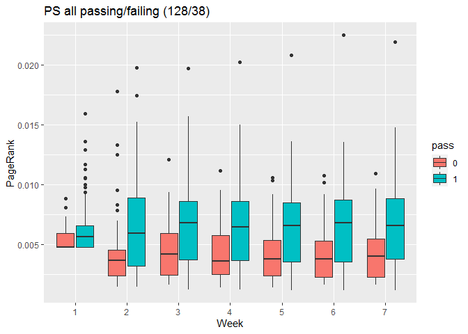
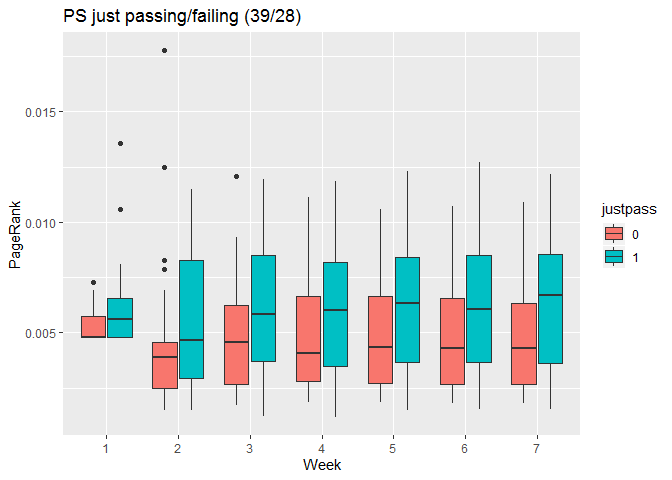
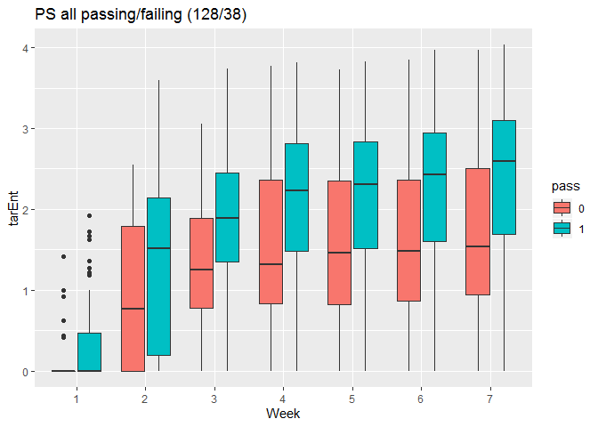
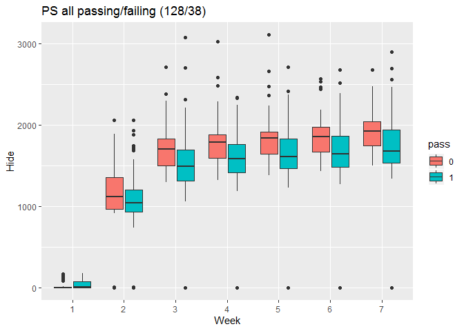

Logistic regression
================
Jesper Bruun & Adrienne Traxler
3/30/2020

Goal for this document is to make exploratory plots and run logistic
regression for passing and failing in the (single-layer) PS, CD, and ICS
weekly networks.

**Update 4/3:** Made data frame for pass/fail centrality boxplots, do
plot commands next.

    ## 
    ## Attaching package: 'igraph'

    ## The following objects are masked from 'package:stats':
    ## 
    ##     decompose, spectrum

    ## The following object is masked from 'package:base':
    ## 
    ##     union

    ## 
    ## Attaching package: 'dplyr'

    ## The following objects are masked from 'package:igraph':
    ## 
    ##     as_data_frame, groups, union

    ## The following objects are masked from 'package:stats':
    ## 
    ##     filter, lag

    ## The following objects are masked from 'package:base':
    ## 
    ##     intersect, setdiff, setequal, union

## Import data

At this point, `loadAllNetworks` and `calculatePR_TE_H` have already
been run. Importing the results of that,

``` r
(load("data/PRTEH.RData"))
```

    ##  [1] "nominator"         "singleICS_S"       "accCD_S"          
    ##  [4] "graphsICS"         "files"             "weeksPS"          
    ##  [7] "FCI_PRE_S"         "accCD"             ".Random.seed"     
    ## [10] "weeksCD"           "accPS_TE"          "singlePS_TE"      
    ## [13] "singleCD_TE"       "singleICS_H"       "singleCD_H"       
    ## [16] "singlePS_H"        "accCD_H"           "biggraph"         
    ## [19] "sInfMatrix"        "weightedAdjacency" "targetEntropy"    
    ## [22] "applyAttr"         "accCD_PR"          "accICS_PR"        
    ## [25] "accICS_S"          "pass"              "paths"            
    ## [28] "FCI_PRE_C"         "JUSTPASS"          "ccWeekNets"       
    ## [31] "accPS_S"           "FCI_PRE"           "SOG"              
    ## [34] "accPS_H"           "searchInformation" "FCI_PRE_0"        
    ## [37] "denominator"       "singleICS_PR"      "accPS_PR"         
    ## [40] "singlePS_PR"       "singleCD_PR"       "singleCD_S"       
    ## [43] "singlePS_S"        "weeksICS"          "graphsPS"         
    ## [46] "dirs"              "accWeekNets"       "PASS"             
    ## [49] "attributes"        "accICS"            "accPS"            
    ## [52] "justpass"          "graphsCD"          "accICS_TE"        
    ## [55] "singleICS_TE"      "accCD_TE"          "accICS_H"         
    ## [58] "TargetEntropy"     "gzero"

There’s a lot in there, but I’m mostly interested in the `accXX`
objects, which hold the accumulated networks as of each week.

``` r
summary(accPS[[7]])
```

    ## IGRAPH f9c3ed0 DNW- 166 1199 -- 
    ## + attr: name (v/c), id (v/c), grade (v/n), gender (v/n), age (v/n),
    ## | cohort (v/n), sog (v/n), fci_pre (v/n), fci_pre_0 (v/n), fci_pre_s
    ## | (v/n), fci_pre_c (v/n), pass (v/n), justpass (v/n), weight (e/n)

``` r
table(E(accPS[[7]])$weight)
```

    ## 
    ##   1   2   3   4   5   6   7 
    ## 634 226 159  66  69  42   3

Take a look at the pass/fail and just pass/just fail counts (these are
the same in all three network layers):

``` r
table(V(accPS[[7]])$pass, useNA = "ifany")
```

    ## 
    ##   0   1 
    ##  38 128

``` r
table(V(accPS[[7]])$justpass, useNA = "ifany")
```

    ## 
    ##    0    1 <NA> 
    ##   28   39   99

``` r
nPass <- table(V(accPS[[7]])$pass, useNA = "ifany")
nJustPass <- table(V(accPS[[7]])$justpass, useNA = "ifany")
```

## Pass/fail boxplots

To do the pass/fail boxplots, I need a data frame with people’s IDs,
their pass/fail outcomes, and their centrality scores. I need this
information for each week, with a column for week number as well.

**TEMP HACK:** Need to avoid duplicate node names, so second “Person14”
gets named "Person16

``` r
dfPS <- vector("list", length = length(accPS))
for (i in seq(dfPS)) {
  df <- igraph::as_data_frame(accPS[[i]], what = "vertices")
  df$Week <- i
  df$PageRank <- accPS_PR[[i]]$vector
  df$tarEnt <- accPS_TE[[i]]
  df$Hide <- accPS_H[[i]]
  
  dfPS[[i]] <- df %>% select(-id)  # ditch id column, it duplicates name + Person14 typo
}
dfPS <- bind_rows(dfPS)
dfPS <- subset(dfPS, select = c(Week, name:Hide))  # reorder to put Week first
# Need factors for plotting
dfPS$Week <- as.factor(dfPS$Week)   
dfPS$pass <- as.factor(dfPS$pass)
dfPS$justpass <- as.factor(dfPS$justpass)   
head(dfPS)
```

    ##   Week    name grade gender age cohort sog fci_pre fci_pre_0 fci_pre_s
    ## 1    1 Person1     2      1  19      3   6      17        17        17
    ## 2    1 Person2    -3      1  20     10  NA      NA         0         6
    ## 3    1 Person3     0      1  22     10   9      NA         0        15
    ## 4    1 Person4     4      1  19      6  20      28        28        28
    ## 5    1 Person5     2      1  27      1   7      26        26        26
    ## 6    1 Person6     4      1  20      2   0      18        18        18
    ##   fci_pre_c pass justpass Week.1    PageRank    tarEnt       Hide
    ## 1         2    1        1      1 0.004780164 0.0000000   0.000000
    ## 2         1    0     <NA>      1 0.005915686 0.4138169 114.230046
    ## 3         1    0        0      1 0.004780164 0.0000000   0.000000
    ## 4         4    1     <NA>      1 0.005997961 0.0000000  13.228819
    ## 5         4    1        1      1 0.004780164 0.0000000   0.000000
    ## 6         3    1     <NA>      1 0.009249618 1.0000000   3.321928

Now, I think, I can do the boxplots I need? For PageRank…

``` r
ggplot(dfPS, aes(x = Week, y = PageRank)) + 
  geom_boxplot(aes(fill = pass)) + #theme(aspect.ratio = 4/7) +
  ggtitle(paste0("PS all passing/failing (",nPass[2],"/",nPass[1],")"))
```

<!-- -->

``` r
dfPS %>% filter(is.na(justpass) == FALSE) %>% 
  ggplot(aes(x = Week, y = PageRank)) + 
  geom_boxplot(aes(fill = justpass)) + #theme(aspect.ratio = 4/7) +
  ggtitle(paste0("PS just passing/failing (",nJustPass[2],"/",nJustPass[1],")"))
```

<!-- -->

The plot for all passing/failing looks pretty much the same as my old
one. The justpass/justfail plot also looks similar, but seems to be
missing some outlier points relative to the old plot. That’s weird,
since it has a few more data points in it.

For Target Entropy:

``` r
ggplot(dfPS, aes(x = Week, y = tarEnt)) + 
  geom_boxplot(aes(fill = pass)) + 
  ggtitle(paste0("PS all passing/failing (",nPass[2],"/",nPass[1],")"))
```

<!-- -->

and for Hide:

``` r
ggplot(dfPS, aes(x = Week, y = Hide)) + 
  geom_boxplot(aes(fill = pass)) + 
  ggtitle(paste0("PS all passing/failing (",nPass[2],"/",nPass[1],")"))
```

<!-- -->
